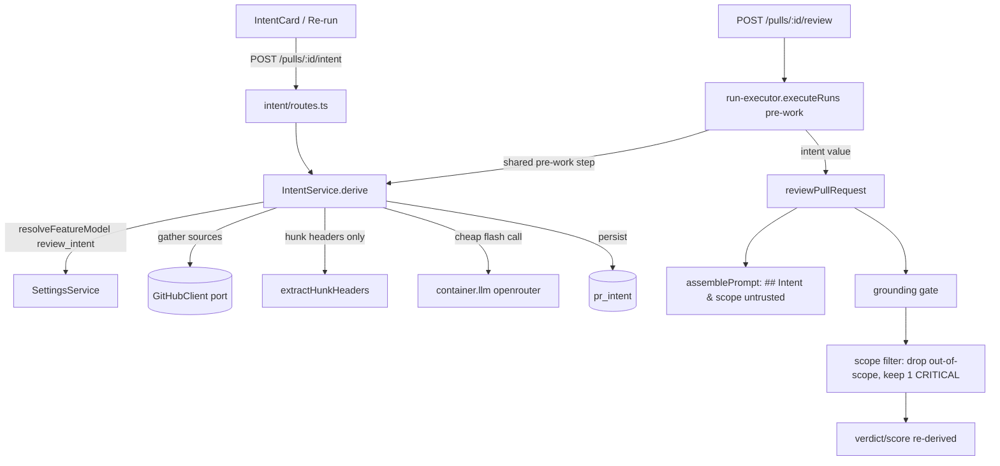

# Development Plan — Intent Layer

**Date:** 2026-08-10 · **Packages:** server / client / reviewer-core
**Assumptions:**
- **New module, not folded into reviews.** Point 3 wants the classifier callable both
  standalone (re-derive endpoint) *and* from the review executor's shared pre-work. A new
  `modules/intent` gives it its own routes/service/repo without swelling the already-large
  reviews module. See §7 R1 for the trade-off and the fallback.
- **The pr_intent table is the store**, extended in place (it already exists,
  `reviews.ts:73`, and already has repo functions in `reviews/repository/pull.repo.ts`).
  The new `modules/intent` reads/writes it through its own repository; the existing
  `upsertIntent`/`getIntent` in the reviews repo are updated for the widened shape so both
  callers agree (§5 step 3).
- **Flash model id** for the `review_intent` default: mirror `onboarding` exactly —
  `openrouter` / `deepseek/deepseek-v4-flash`. This is the only cheap flash entry already
  proven in the registry (`platform.ts:45-51`). See §7 R2 if a different id is wanted.
- **Scope-filter threshold:** an out-of-scope finding is fully dropped **unless** its
  severity is `CRITICAL` (the reviewer-core severity enum is
  `CRITICAL|WARNING|SUGGESTION` — `findings.ts:11`), in which case exactly one survives as
  the single "serious problem outside bounds" signal. See §7 R3.
- **Intent is exposed on read via a dedicated `GET /pulls/:id/intent`**, not folded onto
  `PrDetail` — the card polls/mutates independently of PR detail and `PrDetail` is already
  wide. See §7 R4.

## 1. Scope

**In:**
- Widen the `Intent` contract (add `confidence`, `sources[]`, `missing_context`) in **both**
  `vendor/shared` copies; keep the existing `intent`/`in_scope`/`out_of_scope` fields.
- Change the `review_intent` `FEATURE_MODELS` default to a cheap openrouter flash model in
  **both** registry copies (server contract + client mirror).
- Migration widening `pr_intent` (confidence, sources, missing_context, model, timestamps);
  update the reviews repo's `upsertIntent`/`getIntent`.
- New `modules/intent` (routes + service + repository + helpers + constants): gather sources,
  build the classifier prompt (hunk headers only, no bodies), call the resolved cheap model
  via `container.llm`, persist. Callable standalone and from the review executor.
- Source gathering including linked issue/plan/spec fetch behind the GitHub adapter port,
  with an allowlist; an unavailable source marks `missing_context` and never fabricates.
- A pure hunk-header extraction helper (paths + `@@` lines only).
- reviewer-core: optional `intent` on `PromptParts` + `ReviewInput`; a delimiter-wrapped
  `## Intent & scope` untrusted section; a pure post-grounding **scope filter** that drops
  out-of-scope findings but keeps exactly one CRITICAL out-of-bounds signal, re-deriving
  verdict/score from survivors.
- Wire `IntentService` into `run-executor` shared pre-work as a distinct logged step; pass
  the resolved intent into `reviewPullRequest`.
- `POST /pulls/:id/intent` (derive/re-derive) and `GET /pulls/:id/intent` (read).
- Client: a route-private `IntentCard` in `OverviewTab`, rendered before review results;
  query-key factory entry + read hook + re-derive mutation. Settings already surfaces the
  `review_intent` picker generically — only the default label changes.
- Observability: intent logged as its own trace step (prompt components, model, token
  estimate, sources) — no secrets, no diff bodies; two distinct LLM calls visible.
- Tests: reviewer-core unit (hunk-header extraction, scope filter, prompt section); server
  `*.it.test.ts` (intent repo/service round-trip); client component test (IntentCard).

**Decisions (locked by product owner 2026-08-10):**
- **Classifier default model:** `openrouter` / `deepseek/deepseek-v4-flash` (R2).
- **Re-derivation trigger:** user-triggered (`POST` + Re-run button) **AND** automatic on PR
  head-move during polling (R5). Both paths call the same `IntentService.derive`; the polling
  path is best-effort and must never fail the poll. See step 8b.

**Out:**
- **Deep plan/spec discovery** beyond the linked-issue regex + an explicit ticket/URL
  reference in the body. We reuse `resolveLinkedIssue`'s mechanism and add one allowlisted
  fetch path; a general web crawler is out.
- **Changing the review trigger flow.** Reviews stay a fire-and-forget promise
  (`server/CLAUDE.md` Gotchas); intent runs inside the existing `executeRuns` pre-work.
- Touching `pr_brief` / the `PrBrief` composite — this plan only touches the `Intent`
  sub-schema and the `pr_intent` table.

## 2. Affected surface

| Package | Layer | File | What changes |
|---|---|---|---|
| server | ring 1 · contract | `server/src/vendor/shared/contracts/brief.ts:9-14` | widen `Intent` + add `IntentConfidence`, `IntentSource` |
| server | ring 1 · contract | `server/src/vendor/shared/contracts/platform.ts:52-58` | `review_intent` default → openrouter flash |
| server | ring 3 · schema | `server/src/db/schema/reviews.ts:73-80` | add columns to `prIntent` |
| server | ring 3 · migration | `server/src/db/migrations/0012_*.sql` (new, generated) | ALTER `pr_intent` |
| server | ring 3 · repo | `server/src/modules/reviews/repository/pull.repo.ts:47-68` | widen `upsertIntent`/`getIntent` |
| server | ring 3 · adapter | `server/src/adapters/github/octokit.ts:351-364` | add allowlisted `getIssue`-adjacent fetch for plan/spec link |
| server | ring 1 · port | `server/src/vendor/shared/adapters.ts:143-167` | extend `GitHubClient` if a new fetch method is added |
| server | ring 2 · module (new) | `server/src/modules/intent/{routes,service,repository,helpers,constants}.ts` | the IntentService + endpoints |
| server | ring 4 · registry | `server/src/modules/index.ts:26-37` | one import + one entry |
| server | ring 2 · executor | `server/src/modules/reviews/run-executor.ts:97-107,197-221` | derive intent in pre-work; pass to engine |
| reviewer-core | ring 0 | `reviewer-core/src/prompt.ts:39-73,85-141` | `intent` on `PromptParts`; render `## Intent & scope` |
| reviewer-core | ring 0 | `reviewer-core/src/review/run.ts:44-93,123-219` | `intent` on `ReviewInput`; run scope filter after grounding |
| reviewer-core | ring 0 (new) | `reviewer-core/src/review/scope-filter.ts` | pure out-of-scope filter |
| reviewer-core | ring 0 | `reviewer-core/src/index.ts` | export the new helper(s) |
| client | tier 0 · vendor copy | `client/src/vendor/shared/contracts/brief.ts:9-14` | re-sync widened `Intent` |
| client | tier 2 · mirror | `client/src/lib/feature-models.ts:22-27` | `review_intent` default → openrouter flash |
| client | tier 2 · keys | `client/src/lib/query-keys.ts` (`pr(prId)` block) | add `.intent` |
| client | tier 2 · hook (new) | `client/src/lib/hooks/intent.ts` | `usePrIntent` + `useDerivePrIntent` |
| client | tier 4 · route-private (new) | `client/src/app/repos/[repoId]/pulls/[number]/_components/OverviewTab/_components/IntentCard/` | the card |
| client | tier 4 · route | `.../OverviewTab/OverviewTab.tsx` | render `<IntentCard>` before description/results |

### Call sequence (data flow)

## 3. Constraints in force

| Constraint | Source | Effect on this plan |
|---|---|---|
| reviewer-core zero I/O | `reviewer-core/CLAUDE.md` invariant 1 | intent is **resolved by the server** and passed in as a value; the engine never fetches issues/specs or reads env. Step 6 adds only pure code. |
| never emits JS / raw-TS import | `reviewer-core/CLAUDE.md` invariant 2 | new `scope-filter.ts` is plain TS, exported through `src/index.ts`; no build step. |
| verdict/score/blockers derived from severities | `reviewer-core/CLAUDE.md` invariant 3 | after the scope filter drops findings, re-run `scoreFromFindings` on survivors (as `run.ts:208` already does for grounding). |
| grounding is one shared gate | `reviewer-core/CLAUDE.md` invariant 4 | scope filter runs **after** grounding, as a second post-step — it does not become a per-strategy copy and does not touch the grounding gate. |
| injection defense = single guard + `<untrusted>` | `reviewer-core/CLAUDE.md` invariant 5 | `INJECTION_GUARD` already names "derived intent/scope" (`prompt.ts:19`); render the intent section via `wrapUntrusted`. No keyword scanning. |
| service.ts holds no HTTP/SQL | `server/CLAUDE.md` Layer discipline | IntentService persists via `intent/repository.ts` and calls GitHub via `container.github()`; no drizzle, no fastify import. |
| routes.ts transport only | onion O5 | `intent/routes.ts` = `getContext` → one service call → status; mirrors `pulls/routes.ts`. |
| repository is the only drizzle site | onion O6 | new `intent/repository.ts` owns the `pr_intent` reads/writes it needs; reviews repo keeps its own for the executor path. Both touch `pr_intent` but from their own module (O7 is about not importing a *sibling's* repo, which neither does). |
| new-migration-only | root `CLAUDE.md` Do-not-touch | widen `pr_intent` via `pnpm db:generate` → new `0012_*.sql`; run `cd server && pnpm db:migrate`. Never edit `0000`–`0011`. |
| vendor/shared is one source of truth; client copy drifts | root `CLAUDE.md` Gotchas | edit `server/src/vendor/shared/contracts/brief.ts` first, then hand re-sync `client/src/vendor/shared/contracts/brief.ts` and `client/src/lib/feature-models.ts`. TS will not flag the drift. |
| `*.it.test.ts` split | root `CLAUDE.md`; `TESTING.md` | the DB-backed intent repo/service test ends in `.it.test.ts`; the reviewer-core + client tests are unit (no Docker). |
| secrets never touch DB/git; only SecretsProvider | root `CLAUDE.md`; security | the flash key (`OPENROUTER_API_KEY`) is resolved by `container.llm`; the `model` column stores only the model id, never a key; observability logs no secrets. |
| INSIGHTS.md append-only | root `CLAUDE.md` | if a non-obvious surprise occurs during implementation, append via `engineering-insights`; do not edit existing entries. |

## 4. Skill contract

| Step | Skill | What it dictates here |
|---|---|---|
| 1 | `zod` | widen `Intent` with an `enum` for `confidence`, an object array for `sources[]`, `nullish` where a field may be absent; export both schema and inferred type; parse once at the edge (O8) — the engine receives the typed value. |
| 2 | `drizzle-orm-patterns`, `postgresql-table-design` | jsonb for `sources`/`in_scope`/`out_of_scope` with `$type<...>()` + `default '[]'::jsonb`; `text` for `confidence`/`missing_context`/`model`; `timestamptz` for `derived_at` via the repo's `now()` helper; no new PK (prId stays PK). |
| 2 | `onion-architecture` | repo functions take `Db`, return DTOs; no query builder leaks out. |
| 3 | `onion-architecture`, `fastify-best-practices` | IntentService = impure(gather) → pure(prompt build) → impure(persist); routes use the Zod type provider and `getContext`. |
| 4 | `onion-architecture`, `security` | link fetch stays behind the `GitHubClient` port; allowlist the host/owner-repo before fetching; treat fetched issue/spec text as untrusted (it enters the prompt only inside `<untrusted>`); never fabricate on failure. |
| 6 | reviewer-core `CLAUDE.md` (authoritative) + `typescript-expert` | keep the filter pure and total; exhaustive `severity` handling; re-derive verdict/score from survivors. |
| 8 | `fastify-best-practices` | `POST` returns the derived `Intent`; `GET` returns `Intent | null`; both `schema:{ params: IdParams }`. |
| 9 | `client-architecture`, `react-best-practices`, `next-best-practices` | card is route-private under `OverviewTab/_components/` (C2, C4); one folder with `index.ts`/`styles.ts`; key literal only in `query-keys.ts` (C15); network only through `api` + a hook in `src/lib/hooks/` (C14); visible strings via `useTranslations` (C10). |
| 11 | `react-testing-library` | one flow test for IntentCard (render → shows summary/scope/confidence/sources → Re-run click fires mutation); `fetch` mocked; query priority `getByRole`/`getByText`. |

## 5. Steps

1. **Widen the `Intent` contract (server source of truth).**
   - Package · layer: server · ring 1 (`vendor/shared`).
   - Files: `server/src/vendor/shared/contracts/brief.ts:9-14` (edit).
   - Change: add
     `IntentConfidence = z.enum(['high','medium','low'])`;
     `IntentSource = z.object({ type: z.enum(['pr_body','pr_title','files','issue','plan','spec']), ref: z.string(), status: z.enum(['available','missing']) })`;
     extend `Intent` with `confidence: IntentConfidence`, `sources: z.array(IntentSource).default([])`,
     `missing_context: z.array(z.string()).default([])`. Keep `intent`, `in_scope`, `out_of_scope`.
     Export each schema + inferred type.
   - Skill: `zod`.
   - Done when: `cd server && pnpm typecheck` passes; `Intent` type shows the new fields.
   - Depends on: —

2. **Change the `review_intent` default model (server registry).**
   - Package · layer: server · ring 1.
   - Files: `server/src/vendor/shared/contracts/platform.ts:52-58` (edit).
   - Change: set `defaultProvider: 'openrouter'`, `defaultModel: 'deepseek/deepseek-v4-flash'`
     for the `review_intent` entry; refresh `description` to note it is a cheap classifier.
   - Skill: `zod` (registry is typed by `FeatureModelDef`).
   - Done when: `pnpm typecheck` passes; `defaultFeatureModel('review_intent')` returns the flash choice.
   - Depends on: —

3. **Migrate `pr_intent` and widen the reviews repo helpers.**
   - Package · layer: server · ring 3 (schema + migration + repo).
   - Files: `server/src/db/schema/reviews.ts:73-80` (edit);
     `server/src/db/migrations/0012_*.sql` (new, generated);
     `server/src/modules/reviews/repository/pull.repo.ts:47-68` (edit).
   - Change: add to `prIntent` —
     `confidence: text('confidence').notNull().default('low')`,
     `sources: jsonb('sources').$type<IntentSource[]>().notNull().default(sql\`'[]'::jsonb\`)`,
     `missingContext: jsonb('missing_context').$type<string[]>().notNull().default(sql\`'[]'::jsonb\`)`,
     `model: text('model')`,
     `derivedAt: timestamp('derived_at', { withTimezone: true }).notNull().defaultNow()`.
     Then `pnpm db:generate` (produces `0012_*.sql`; do not hand-edit). Update `upsertIntent`
     to write the new columns and `getIntent` to map them into the widened `Intent` DTO
     (default `confidence` → `'low'`, `sources`/`missing_context` → `[]` for legacy rows).
   - Skill: `drizzle-orm-patterns`, `postgresql-table-design`, `onion-architecture`.
   - Done when: `pnpm db:generate` emits one new migration; `cd server && pnpm db:migrate`
     applies it; `pnpm typecheck` passes. (Does not compile until step 1 lands the type.)
   - Depends on: 1

4. **Add the pure hunk-header extraction helper (reviewer-core-independent, server-side).**
   - Package · layer: server · ring 2 (`modules/intent/helpers.ts`).
   - Files: `server/src/modules/intent/helpers.ts` (new).
   - Change: `extractHunkHeaders(diff: UnifiedDiff): { path: string; headers: string[] }[]` —
     for each file, emit the file path plus one `@@ -a,b +c,d @@` line per hunk reconstructed
     from `DiffHunk` (`oldStart/oldLines/newStart/newLines`, `adapters.ts:175-183`).
     **No hunk bodies, no added/removed lines.** Also a `formatIntentSources(...)` pure
     formatter for the prompt/log if useful.
   - Skill: pure helper (`helpers.ts` per `server/CLAUDE.md`).
   - Done when: unit test (step 11) asserts output contains only paths + `@@` headers and no
     code lines; `pnpm typecheck` passes.
   - Depends on: —

5. **Add plan/spec link fetch behind the GitHub port with an allowlist.**
   - Package · layer: server · ring 3 adapter (+ ring 1 port if a new method is added).
   - Files: `server/src/adapters/github/octokit.ts:126-135,351-364` (edit);
     `server/src/vendor/shared/adapters.ts:143-167` (edit only if adding a method).
   - Change: reuse `resolveLinkedIssue` (regex `closes|fixes|resolves #N`, `octokit.ts:128`)
     for the issue source. For a plan/spec, resolve **only** references that are (a) an issue
     `#N` in the same repo, or (b) an in-repo path under an allowlisted set (e.g. `specs/`,
     `docs/`, `*.md`) fetched via the existing `GitClient.readFile` or a new
     `getRepoFile(repo, path)` on `GitHubClient`. Reject anything else (arbitrary external
     URLs) and mark it `missing`. Return a discriminated result `{ ref, status, text? }` so
     the service records `missing_context` without fabricating. Keep the port shaped by our
     need (O2), not by Octokit's surface.
   - Skill: `onion-architecture`, `security` (allowlist the fetch target; fetched text is
     untrusted and only ever reaches the model inside `<untrusted>`).
   - Done when: the adapter returns `{status:'missing'}` for a disallowed/absent ref and
     never throws to the caller; `pnpm typecheck` passes.
   - Depends on: —

6. **reviewer-core: intent prompt section + pure scope filter.**
   - Package · layer: reviewer-core · ring 0.
   - Files: `reviewer-core/src/prompt.ts:39-73,85-141` (edit);
     `reviewer-core/src/review/scope-filter.ts` (new);
     `reviewer-core/src/review/run.ts:44-93,123-219` (edit);
     `reviewer-core/src/index.ts` (edit — export the filter).
   - Change:
     - `PromptParts.intent?: { summary: string; inScope: string[]; outOfScope: string[] }`
       (a plain resolved string-bag, **not** the Zod type — keep ring 0 free of the contract).
       Render a `## Intent & scope` section via `wrapUntrusted('intent', …)` **before**
       `## Diff to review`; add `intent` to the returned `PromptAssembly` (extend
       `trace.ts` `PromptAssembly` with `intent: z.string().nullish()` in step 10).
     - `scope-filter.ts`: `applyScopeFilter(findings, intent) → { kept, dropped }`. A finding
       is out-of-scope when its `file`/`title` matches an `outOfScope` entry and no `inScope`
       entry (matching rule stated in the file's doc comment; keep it conservative — substring
       on file path). Drop out-of-scope findings **except** keep exactly one whose severity is
       `CRITICAL` (the single never-silenced signal); annotate that survivor's rationale as
       "outside the PR's stated scope". Pure and total over the `Severity` enum.
     - In `run.ts`, after the grounding gate (`run.ts:197-202`), when `input.intent` is
       present, run `applyScopeFilter` on `ground.kept`, then set
       `findings: filtered.kept, score: scoreFromFindings(filtered.kept)` and emit the dropped
       ones via `onEvent` (never silent). Verdict already flows from `reduceReviews`; if a
       verdict re-derivation from survivors is wanted, keep it consistent with invariant 3.
   - Skill: reviewer-core `CLAUDE.md` (authoritative) + `typescript-expert`.
   - Done when: `cd reviewer-core && npm run typecheck` passes; unit tests (step 11) prove a
     CRITICAL out-of-bounds finding survives while lower-severity out-of-scope ones drop, and
     the score matches survivors.
   - Depends on: —

7. **The IntentService + module (routes/service/repository/constants).**
   - Package · layer: server · rings 2–4.
   - Files: `server/src/modules/intent/service.ts`, `repository.ts`, `routes.ts`,
     `constants.ts` (all new); `server/src/modules/index.ts:26-37` (edit — one import + entry).
   - Change:
     - `IntentService.derive(workspaceId, prId, log): Promise<Intent>` —
       impure: load PR (via `container.reviewRepo.getPull` or its own repo), gather sources
       (title, body, files+hunk-headers via step 4, linked issue/plan/spec via step 5),
       resolve the model with `new SettingsService(container).resolveFeatureModel(workspaceId,'review_intent')`
       (mirrors conventions `service.ts:238`), resolve the provider with `container.llm(...)`;
       pure: build the classifier prompt (title/desc/issue/plan/spec + file list with hunk
       headers only — **diff bodies never sent**); impure: `llm.completeStructured<Intent>({
       model, schema: Intent, schemaName:'Intent', messages })` — **a second, separate LLM
       call** from the review; set `confidence` lower when the PR body is empty (title + file
       names + hunk headers only); attach `sources[]` with per-source `status` and populate
       `missing_context` for any unavailable link; persist via the module's `repository.ts`
       (writing `model` + `derived_at`). Never fabricate a missing source.
     - `repository.ts`: `getForPr(db, prId)` / `upsert(db, prId, intent, model)` over
       `pr_intent` (the only drizzle site for this module).
     - `routes.ts`: `POST /pulls/:id/intent` → `getContext` → `service.derive` → `200 Intent`;
       `GET /pulls/:id/intent` → `service.get` → `Intent | null`. Transport only.
     - Register `intent` in `modules/index.ts`.
   - Skill: `onion-architecture`, `fastify-best-practices`.
   - Done when: `pnpm typecheck` passes; a manual `POST` returns an `Intent` and `GET`
     returns it back. (Compiles only after steps 1–5.)
   - Depends on: 1, 3, 4, 5

8. **Wire intent into the review executor's shared pre-work.**
   - Package · layer: server · ring 2 (`reviews/run-executor.ts`).
   - Files: `server/src/modules/reviews/run-executor.ts:97-107,197-221` (edit).
   - Change: after the "Loading PR diff" step (`run-executor.ts:99`), add a distinct
     `runLog.step('Deriving PR intent', () => intentService.derive(workspaceId, pull.id, ...),
     { kind: 'tool' })` fanned to every queued run (it is shared pre-work, matching the
     RunLogger doc at `run-logger.ts:5-18`). On failure, degrade: log and continue with no
     intent (a broken classifier must not fail the review — same posture as the repo-intel
     best-effort digests, `run-executor.ts:176-183`). Pass the resolved intent into
     `reviewPullRequest({ ..., ...(intent ? { intent: toEngineIntent(intent) } : {}) })`
     where `toEngineIntent` maps the contract DTO → the engine's plain string-bag.
     Construct the `IntentService` from `this.container` (the executor already holds it).
   - Skill: `onion-architecture` (service owns the I/O; the engine receives a value),
     `fastify-best-practices` (N/A here — background path).
   - Done when: a review run's Live Log shows a "Deriving PR intent" step **and** the model
     call, i.e. two distinct LLM calls; `pnpm typecheck` passes.
   - Depends on: 6, 7

8b. **Auto re-derive intent on PR head-move during polling.**
    - Package · layer: server · ring 2 (`modules/polling`).
    - Files: `server/src/modules/polling/service.ts:38-66` (edit);
      `server/src/modules/polling/repository.ts` (edit — have `upsertPull` report whether the
      stored `head_sha` changed, e.g. return `{ prId, headChanged }`, or add a
      `findPullHead(repoId, number)` read to compare before upsert).
    - Change: in `pollRepo`, when an EXISTING PR's `head_sha` changes on this sync AND that PR
      already has a stored intent (`intentRepo.getForPr` non-null), fire a **best-effort**
      `IntentService.derive(workspaceId, prId)` — do NOT await it into the poll's failure path
      and never let a classifier error fail the poll (wrap in try/catch → `log.warn`). Construct
      `IntentService` from `this.container`. Rationale: keep the manual "loud failure" posture
      for the GitHub sync itself, but treat intent re-derivation like the best-effort
      enrichments elsewhere. Do not re-derive for PRs that never had an intent (avoid
      classifier cost on every unreviewed PR).
    - Skill: `onion-architecture` (service owns I/O; polling repo stays the only drizzle site).
    - Done when: polling a repo whose PR head moved re-derives that PR's intent (visible as a
      new `derived_at` + a log line) while a classifier failure leaves `synced` unaffected;
      `pnpm typecheck` passes.
    - Depends on: 7.

9. **Client: re-sync contract, keys, hook, and the IntentCard.**
   - Package · layer: client · tiers 0/2/4.
   - Files:
     `client/src/vendor/shared/contracts/brief.ts:9-14` (edit — hand re-sync step 1);
     `client/src/lib/feature-models.ts:22-27` (edit — re-sync step 2);
     `client/src/lib/query-keys.ts` `pr(prId)` block (edit — add `intent: ["pr", prId, "intent"]`);
     `client/src/lib/hooks/intent.ts` (new);
     `client/src/app/repos/[repoId]/pulls/[number]/_components/OverviewTab/_components/IntentCard/{IntentCard.tsx,index.ts,styles.ts,constants.ts,IntentCard.test.tsx}` (new);
     `.../OverviewTab/OverviewTab.tsx` (edit — render `<IntentCard prId=… />` before the description).
   - Change:
     - `hooks/intent.ts`: `usePrIntent(prId)` → `useQuery(qk.pr(prId).intent, GET /pulls/:id/intent)`;
       `useDerivePrIntent(prId)` → `useMutation(POST /pulls/:id/intent)` invalidating
       `qk.pr(prId).intent` (and `qk.pr(prId).reviews` if a re-derive should re-surface). All
       network through `api` (C14); no key literals outside `query-keys.ts` (C15).
     - `IntentCard`: renders summary, in-scope / out-of-scope lists, a confidence badge,
       `sources[]` with availability, a `missing_context` warning, and a **Re-run** button
       wired to `useDerivePrIntent`. Loading/empty/error states. Visible strings via
       `useTranslations` + a messages namespace (C10); styling in `styles.ts` `s` object with
       `var(--token)` colours (C9); reuse `@devdigest/ui` primitives, do not extend vendor.
     - `OverviewTab`: render `<IntentCard>` **before** the description/results so the user
       verifies understanding first (point 4).
   - Skill: `client-architecture`, `react-best-practices`, `next-best-practices`.
   - Done when: `cd client && pnpm typecheck` passes; the card renders on the PR page before
     results. Settings already lists `review_intent` generically (`SettingsModels.tsx:39`) —
     no settings-UI change beyond the mirror default.
   - Depends on: 1, 2, 7

10. **Observability: an intent trace section + two visible LLM calls.**
    - Package · layer: server · ring 1 contract + ring 2 wiring.
    - Files: `server/src/vendor/shared/contracts/trace.ts:39-53` (edit — add `intent` to
      `PromptAssembly`); its client copy re-synced; `server/src/modules/intent/service.ts`
      (log the prompt components, chosen model, a token estimate, and the source list via
      `runLog`/logger); `run-executor.ts` trace assembly (`run-executor.ts:265-295`) already
      persists `prompt_assembly` — ensure the intent string flows in when present.
    - Change: emit one structured log for the intent call with `{ model, sources, tokenEst,
      promptComponents }` and **no** secret and **no** diff body. The intent classifier call
      and the review call are already separate LLM invocations (steps 7 + 6/8); the trace's
      `tool_calls` / Live Log must show both distinctly. Token estimate = a cheap
      `estimateTokens(text)` (chars/4) helper in `intent/helpers.ts`; do not pull a tokenizer
      into ring 1.
    - Skill: none repo-specific — follow the `RunLogger` contract (`run-logger.ts`).
    - Done when: a run trace shows an intent step with model + sources + a token estimate and
      no diff content; `pnpm typecheck` passes.
    - Depends on: 8

11. **Tests.**
    - Package · layer: reviewer-core (unit), server (`*.it.test.ts`), client (unit).
    - Files:
      `reviewer-core/test/scope-filter.test.ts`, `reviewer-core/test/prompt-intent.test.ts` (new);
      `server/src/modules/intent/helpers.test.ts` (new, unit — hunk headers);
      `server/test/intent.it.test.ts` (new, integration — repo/service round-trip);
      `client/.../IntentCard/IntentCard.test.tsx` (new).
    - Change: cover (a) hunk-header extraction emits only paths + `@@` lines, no bodies;
      (b) scope filter drops out-of-scope, keeps exactly one CRITICAL, re-derives score;
      (c) prompt renders `## Intent & scope` inside `<untrusted>`; (d) intent persists and
      reads back through the widened `pr_intent` on real Postgres; (e) IntentCard renders
      summary/scope/confidence/sources + missing-context warning and Re-run fires the mutation.
    - Skill: `react-testing-library` (client), `TESTING.md` conventions.
    - Done when: each lane's command (below) passes.
    - Depends on: 4, 6, 7, 9

## 6. Test strategy

| What | Lane | File | Command |
|---|---|---|---|
| hunk-header extraction (no bodies) | server unit | `server/src/modules/intent/helpers.test.ts` | `cd server && pnpm exec vitest run --exclude '**/*.it.test.ts'` |
| intent repo/service round-trip (widened `pr_intent`) | server integration (Docker) | `server/test/intent.it.test.ts` | `cd server && pnpm exec vitest run .it.test` |
| scope filter + intent prompt section | reviewer-core unit | `reviewer-core/test/scope-filter.test.ts`, `.../prompt-intent.test.ts` | `cd reviewer-core && npm test` |
| IntentCard renders + Re-run mutation | client | `.../IntentCard/IntentCard.test.tsx` | `cd client && pnpm test` |

Typecheck: server `cd server && pnpm typecheck` · client `cd client && pnpm typecheck` ·
reviewer-core `cd reviewer-core && npm run typecheck`.
Integration lane needs Docker; if it "skips", export `DOCKER_HOST` +
`TESTCONTAINERS_DOCKER_SOCKET_OVERRIDE` per `server/INSIGHTS.md` (2026-08-05 entries).

## 7. Risks & open questions

| # | Question | Default if unanswered | Blocks step |
|---|---|---|---|
| R1 | New `modules/intent` vs fold into `modules/reviews`? | New module (needs standalone endpoints + executor reuse; keeps reviews from growing). Fallback: fold into reviews if the module ends up a thin passthrough. | 7 |
| R2 | Exact cheap flash model id? | `openrouter`/`deepseek/deepseek-v4-flash` (mirrors `onboarding`, already registry-proven). | 2 |
| R3 | Scope-filter severity threshold for the one kept signal? | Keep exactly one `CRITICAL`; drop `WARNING`/`SUGGESTION` when out-of-scope. | 6 |
| R4 | Expose intent on `PrDetail` or a dedicated `GET`? | Dedicated `GET /pulls/:id/intent` (independent polling/mutation; `PrDetail` already wide). | 7, 9 |
| R5 | Re-derive automatically on PR update, or user-triggered only? | **DECIDED: both** — `POST`/Re-run button AND best-effort auto re-derive on head-move in polling (step 8b). | 7, 8b |
| R6 | How is an out-of-scope finding matched? | Conservative substring match of the finding's `file` against `out_of_scope` entries, with `in_scope` winning ties; doc-comment the rule in `scope-filter.ts`. | 6 |
| R7 | Plan/spec fetch surface — new `GitHubClient.getRepoFile` or reuse `GitClient.readFile`? | Add `getRepoFile(repo, path)` to the GitHub port (keeps all PR-context I/O behind one adapter); allowlist `specs/`,`docs/`,`*.md`. | 5 |

## 8. Acceptance criteria

- [ ] `Intent` carries `confidence`, `sources[]` (`{type,ref,status}`), `missing_context` in
      **both** `server/src/vendor/shared/contracts/brief.ts` and
      `client/src/vendor/shared/contracts/brief.ts`; `cd server && pnpm typecheck` and
      `cd client && pnpm typecheck` pass.
- [ ] `defaultFeatureModel('review_intent')` returns `openrouter`/`deepseek/deepseek-v4-flash`
      in both the server registry and `client/src/lib/feature-models.ts`.
- [ ] `pnpm db:generate` produced a new `0012_*.sql`; `cd server && pnpm db:migrate` applies it;
      no `0000`–`0011` file changed (`git diff --name-only` shows only a new migration).
- [ ] `POST /pulls/:id/intent` returns an `Intent`; `GET /pulls/:id/intent` returns it back
      (verified by `server/test/intent.it.test.ts` on real Postgres).
- [ ] The classifier prompt contains file paths + `@@` hunk headers and **no** diff bodies
      (asserted by `server/src/modules/intent/helpers.test.ts`).
- [ ] An unavailable linked issue/plan/spec sets `status:'missing'` on that source and adds a
      `missing_context` entry — no fabricated content.
- [ ] reviewer-core renders `## Intent & scope` inside `<untrusted>` and the scope filter keeps
      exactly one CRITICAL out-of-bounds finding while dropping lower-severity out-of-scope
      ones, re-deriving score from survivors (`cd reviewer-core && npm test`).
- [ ] A review run's Live Log / trace shows **two** distinct LLM calls: "Deriving PR intent"
      (flash) and the review call.
- [ ] Polling a repo whose PR head moved re-derives that PR's stored intent best-effort; a
      classifier failure logs a warning and leaves the poll's `synced` count unaffected.
- [ ] The intent trace section logs prompt components, model, a token estimate, and the source
      list with **no** secrets and **no** diff content.
- [ ] `IntentCard` renders on the PR page **before** the review results, showing summary,
      in/out scope, confidence, sources+availability, a missing-context warning, and a Re-run
      button (`cd client && pnpm test`).
