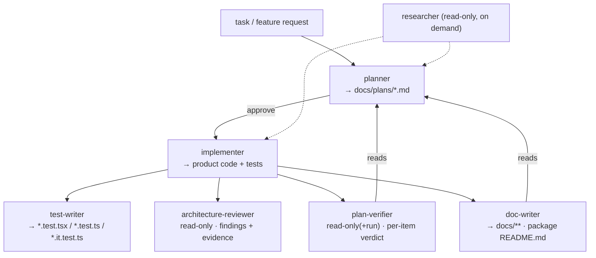

# Development Plan — four new project subagents (test-writer, architecture-reviewer, plan-verifier, doc-writer)

**Date:** 2026-08-10 · **Packages:** none — this is a meta/authoring task under `.claude/agents/` and `docs/plans/`
**Assumptions:**
- The four agents are authored as Markdown files with YAML frontmatter, matching the house style set by `researcher.md`, `planner.md`, `implementer.md` verbatim (multi-sentence `description` stating what it *is* and *is not* for; body with modes/method/fixed output contract/"Hard rules"; `.claude/agents/README.md` catalog row + per-agent section).
- Frontmatter fields and semantics are exactly those documented at the Claude Code sub-agents docs (https://code.claude.com/docs/en/sub-agents), as pre-verified by the caller: `name`, `description`, `tools`, `disallowedTools`, `model`, `color`, `skills`. No new field is invented.
- Read-only means: do **not** grant `Write`/`Edit` in `tools`, and instruct `Bash` to be observation-only — mirroring `researcher.md:158-161`.
- These four agents preload **scoped** skill sets (not all 14 like planner/implementer), justified per agent in section 5 and section 7.
- "Tests" for these Markdown files = a YAML-parse check of each frontmatter block + a link-resolution check for the README (not vitest), per the caller's instruction.

## 1. Scope

**In:**
- Four new files under `.claude/agents/`: `test-writer.md`, `architecture-reviewer.md`, `plan-verifier.md`, `doc-writer.md`.
- Each with complete frontmatter (`name`, `description`, `tools`, `disallowedTools` where applicable, `model`, `color`, `skills`), a body defining input artifact + fixed output contract + method + skill-routing table + "Hard rules", following the three existing agents verbatim as the convention.
- One edit to `.claude/agents/README.md`: add a catalog-table row per agent, and a per-agent section (Responsibility · Permissions table · In · Out · and a "Sources its rules rest on" table for the non-trivial ones — architecture-reviewer, plan-verifier, test-writer, doc-writer). Also update the "Architecture review and security review are **not** in this set" note near `README.md:20-22`, since architecture-reviewer now joins the set (security review still does not).
- A YAML-parse verification step and a README link-resolution step (the "tests" for this task).

**Out:**
- **No security-reviewer agent.** The caller scoped exactly four agents; security review stays out of the set. architecture-reviewer rules on architecture *only* and its `description` must say security is out of scope.
- **No change to any skill** under `.claude/skills/**`, and no change to the three existing agents' bodies (only their README catalog row context is touched via the "not in this set" note update).
- **No hook wiring** (`.claude/settings.json`, `.claude/hooks/`) — these agents are invoked via the Task tool / delegation, not gated by a push hook. Frontmatter fields `permissionMode`, `hooks`, `isolation`, etc. stay unused, consistent with `README.md:172-173`.
- **No product code, no migrations, no tests under any package's `test/`.** Nothing outside `.claude/agents/` and `docs/plans/`.

## 2. Affected surface

| Package | Layer | File | What changes |
|---|---|---|---|
| repo meta | agents | `.claude/agents/test-writer.md` | **new** — writes+runs tests only (client + server + reviewer-core), never product code |
| repo meta | agents | `.claude/agents/architecture-reviewer.md` | **new** — read-only architectural boundary auditor (onion + client tiers + vendor/shared) |
| repo meta | agents | `.claude/agents/plan-verifier.md` | **new** — read-only (+ run-named-commands) plan/acceptance-criteria checklist verifier |
| repo meta | agents | `.claude/agents/doc-writer.md` | **new** — documents implemented features into `docs/**` + package `README.md`, with diagrams |
| repo meta | agents | `.claude/agents/README.md:12-22` | edit — 4 new catalog rows; update the "not in this set" note (architecture-reviewer joins) |
| repo meta | agents | `.claude/agents/README.md` (new sections after `researcher`, before "The shared skill set") | edit — per-agent section for each of the four |

The set after this change (delegation topology):



## 3. Constraints in force

| Constraint | Source | Effect on this plan |
|---|---|---|
| Isolated context window; only the final message returns → each agent needs a FIXED output contract | Claude Code sub-agents docs, https://code.claude.com/docs/en/sub-agents; restated `.claude/agents/README.md:3-7` | Every new agent body ends with a fixed output-format block (a report shape), exactly as researcher/planner/implementer do. |
| Frontmatter field set is exactly `name`/`description`/`tools`/`disallowedTools`/`model`/`color`/`skills` | Claude Code sub-agents docs, https://code.claude.com/docs/en/sub-agents; enumerated `.claude/agents/README.md:162-170` | Author uses only these fields; no invented keys. `name` is lowercase+hyphens. |
| Read-only = omit `Write`/`Edit`; Bash is observation-only by instruction | `researcher.md:4` (`tools: Read, Grep, Glob, Bash, WebSearch, WebFetch`), `researcher.md:158-161` | architecture-reviewer and plan-verifier get **no** `Write`/`Edit` in `tools`, and a Bash-scope paragraph limiting Bash to `git log/diff/show/blame`, `rg`, `ls`, and (plan-verifier only) the plan's named test/typecheck commands. |
| `description` must state trigger AND what the agent is NOT for | `planner.md:3`, `implementer.md:3`, `researcher.md:3`; rule `.claude/agents/README.md:177-178` | Each `description` names its trigger phrases and an explicit "Not for …" clause that keeps architecture / security / verification / testing cleanly separated. |
| Grant the narrowest `tools` that still lets it finish; one responsibility per agent | `.claude/agents/README.md:176-180` | test-writer gets `Write`/`Edit`+`Bash` (test files + vitest only); doc-writer gets `Write`/`Edit`+`Bash` (docs + read-only git); the two reviewers get neither. |
| `skills:` preloads full `SKILL.md` at startup (~cost); scope to the job | `planner.md:7-22`, `implementer.md:8-23`, cost note `.claude/agents/README.md:148-152` | Each of the four gets a **scoped** subset, justified in section 7 — not the shared 14. |
| Onion inward-only (`O1`–`O9`), client five tiers (`C1`–`C16`), vendor/shared source-of-truth | root `CLAUDE.md`, `server/CLAUDE.md` "Layer discipline", `client/CLAUDE.md` "Conventions", `onion-architecture`/`client-architecture` SKILL.md | These are the rules architecture-reviewer audits and the guardrails test-writer respects; they are quoted into those two agents' bodies and their "Sources" tables. |
| `*.it.test.ts` split is load-bearing: a DB-backed test importing `test/helpers/pg.ts` MUST carry that suffix | `TESTING.md:79-82`, `server/CLAUDE.md` Gotchas ("A DB-backed test must be named `*.it.test.ts`"), `server/README.md:147-149` | test-writer's body mandates the suffix decision and states which lane a new test lands in; it reports a skipped integration lane (no Docker) as skipped, never passed. |
| `INSIGHTS.md` is append-only, written ONLY through `engineering-insights` | root `CLAUDE.md` "Do not touch", `engineering-insights` SKILL.md | doc-writer must NOT write `INSIGHTS.md` directly; its write scope excludes it, and its body routes any insight through the `engineering-insights` skill. |
| `server/src/vendor/shared/` is the ONE source of truth; client copy has drifted | root `CLAUDE.md` Gotchas, `client/CLAUDE.md` Gotchas | architecture-reviewer checks vendor/shared source-of-truth; doc-writer documents the server copy as authoritative. |
| Reviewer-prompt docs have a canonical home | `docs/agent-prompts/README.md:7-18` | doc-writer's routing rule sends reviewer-prompt changes to `docs/agent-prompts/` and reminds to also push to the agent (`PUT /agents/:id`). |
| pnpm in server/client, npm in reviewer-core/e2e | `docs/architecture.md:18-19`, `TESTING.md:60-75` | test-writer's run-commands table uses the correct runner per package. |

## 4. Skill contract

Skills the **author (implementer of this plan)** must apply while writing the files:

| Step | Skill | What it dictates here |
|---|---|---|
| 6 (verify) | `mermaid-diagram` | The README delegation diagram and any diagram embedded in doc-writer's body use valid Mermaid (`flowchart`, labelled edges). |
| 1–5 (authoring) | — (Markdown authoring, not code) | No code-governing skill applies to writing `.md` agent files; the skill *content* is quoted, not executed. The `skills:` lists chosen **for** each new agent are decided in section 5 / section 7, not invoked here. |

Note: this is an authoring task, so the section-4 contract is thin by design — the substantive skill decisions are the `skills:` frontmatter chosen for each of the four new agents (section 5).

## 5. Steps

Each of steps 1–4 creates one agent file. The frontmatter is fully specified below; the body follows the house structure (mode/method → skill-routing table keyed by path → fixed output contract → "Hard rules"), quoting the relevant `CLAUDE.md`/skill rules the way planner/implementer do. Do **not** paste full skill text — cite `path` and the rule id.

---

### Step 1 — Author `test-writer.md`

- Files: `.claude/agents/test-writer.md` (new)
- Depends on: —
- Skill (for authoring): —
- **Frontmatter:**
  - `name: test-writer`
  - `description:` 2 sentences. Trigger: "write tests for this component/module/feature", "add coverage for X", "test the client component / the server route / the reviewer-core engine". **Not for:** changing product code to make a test pass (that is `implementer`), deciding what to build (`planner`), or ruling on architecture/security. Explicitly: it writes AND runs tests only.
  - `tools: Read, Edit, Write, Grep, Glob, Bash, Skill, TodoWrite` (Write/Edit scoped **by instruction** to test files only; Bash for vitest + typecheck + read-only git)
  - `model: sonnet` (test authoring is mechanical against a fixed skill; matches researcher's tier, keeps cost down)
  - `color: yellow`
  - `skills:` — `react-testing-library`, `react-best-practices`, `next-best-practices`, `client-architecture`, `onion-architecture`, `fastify-best-practices`, `drizzle-orm-patterns`, `zod`, `typescript-expert`, `engineering-insights` (justified in §7; **excludes** `postgresql-table-design`, `security`, `pr-self-review`, `mermaid-diagram`).
- **Body must define:**
  - **Input artifact:** a target to test — a component/route/module path, or a plan step referencing new code, plus the base ref for "what changed".
  - **Skill-routing table keyed by path** (the contract that enforces the caller's requirement):

    | Surface under test | Invoke | Test file lands in |
    |---|---|---|
    | `client/**/*.tsx` component/hook | `react-testing-library` + `react-best-practices`/`next-best-practices` for context | `<Component>.test.tsx` colocated (jsdom, `fetch` mocked) |
    | `server/src/modules/**`, `adapters/**` (DB-free) | `onion-architecture`, `fastify-best-practices`, `zod`, `typescript-expert` | `*.test.ts` (unit lane) |
    | `server/**` DB-backed (imports `test/helpers/pg.ts`) | `drizzle-orm-patterns` + `onion-architecture` | **`*.it.test.ts`** (integration lane) |
    | `reviewer-core/**` pure engine | `onion-architecture` (zero-I/O), `typescript-expert` | `*.test.ts`, stubbed `LLMProvider` |
  - **The `.it.test.ts` decision rule**, quoted from `TESTING.md:79-82` and `server/CLAUDE.md` Gotchas: DB-backed → that suffix; else unit.
  - **Run-commands table** (per-package runner from `TESTING.md:60-75`):

    | Lane | Command | Docker |
    |---|---|---|
    | client | `cd client && pnpm test` · `pnpm typecheck` | no |
    | server unit | `cd server && pnpm exec vitest run --exclude '**/*.it.test.ts'` | no |
    | server integration | `cd server && pnpm exec vitest run .it.test` | **yes** |
    | reviewer-core | `cd reviewer-core && npm test` · `npm run typecheck` | no |
  - **Docker/skipped-lane rule:** the server integration lane needs Docker; when Docker is unavailable the tests self-skip (`TESTING.md:49-51`). test-writer reports that lane as **skipped — Docker unavailable**, never as passed (mirror `implementer.md:130-132`).
  - **Hard rule — never touches product code:** if a test fails because the code is wrong, it reports the failure and hands back to `implementer`; it does not edit non-test files. Mirror `implementer.md`'s "report failures as failures" discipline.
  - **Fixed output contract:** a report with sections — `## Tests written` (per file, path + what it covers + which lane) · `## Verification` (verbatim command tail + a per-lane pass/skip table) · `## Could not test` (what and why — e.g. Docker absent, missing key) · `## Handoff` (any product-code bug found, described not fixed).
- **Done when:** file parses as YAML frontmatter (step 5) and contains all seven concerns above (skill-routing table, `.it.test.ts` rule, run-commands table, skipped-lane rule, no-product-code rule, fixed output contract, scoped `skills:` list).

### Step 2 — Author `architecture-reviewer.md`

- Files: `.claude/agents/architecture-reviewer.md` (new)
- Depends on: —
- **Frontmatter:**
  - `name: architecture-reviewer`
  - `description:` 2 sentences. Trigger: "review the architecture/layering of this diff or module", "check onion boundaries", "audit client tier imports", "does this respect vendor/shared". **Not for:** security review, correctness/bug hunting, test quality, or fixing anything — it rules on architecture ONLY and returns findings, never edits.
  - `tools: Read, Grep, Glob, Bash` (**no Write, no Edit**; Bash observation-only)
  - `model: opus` (boundary reasoning across the ring/tier maps is the hard-judgment case; matches planner/implementer tier)
  - `color: red`
  - `skills:` — `onion-architecture`, `client-architecture` (the two mandated minimums; justified §7 — **excludes** all reference skills and `security`).
- **Body must define:**
  - **Two scopes** (mirroring the skills' own "Audit mode", `onion-architecture` §Audit mode, `client-architecture` §Audit mode): **branch mode** (`git diff main...HEAD --name-only`, or `git diff --name-only HEAD` for uncommitted) and **module mode** (a named directory, current state).
  - **The inherited "changed lines only" guard** in branch mode and **"a clean diff gets one line saying so"** — quoted from both skills' Audit mode and `pr-self-review` §"Two inherited guards".
  - **Authoritative-rules first:** it must read `server/CLAUDE.md` "Layer discipline" and `reviewer-core/CLAUDE.md` "Hard invariants" (backend) and `client/CLAUDE.md` "Conventions" (client) before auditing, per each skill's Audit-mode step 1; those files win on conflict.
  - **What it checks:** onion inward-only `O1`–`O9` (routes/service/repository separation, reviewer-core zero-I/O), client five-tier downward-only `C1`–`C16`, vendor/shared source-of-truth. Ring/tier classification by path.
  - **Finding format with EVIDENCE + severity + explicit "not found"** — borrow the block shape from `onion-architecture` §Audit-mode report and the evidence+"searched Y" discipline from `researcher.md:98` and `pr-self-review`:

    ```
    [O4] service.ts holds no SQL — severity: CRITICAL
    Evidence: server/src/modules/foo/service.ts:42 — imports `eq` from drizzle-orm
    Why:      server/CLAUDE.md "service.ts holds no raw SQL"
    Fix:      move the query into repository.ts (stated, not applied)
    ```

    plus a mandatory clean line: `No violations found in <scope> — searched <rules/paths>.`
  - **Severity vocabulary:** reuse the product's `CRITICAL`/`WARNING`/`SUGGESTION` (from `pr-self-review` / `findings.ts`) rather than inventing a scale — keeps it consistent with the rest of the set.
  - **Hard rules:** read-only (no Write/Edit; Bash observation-only, `researcher.md:158-161`); rules on architecture ONLY — security and correctness are explicitly out; never reports a pre-existing violation on an untouched line as a finding of the diff (both skills' "Never" lists); never manufactures a finding to look thorough.
  - **Fixed output contract:** `## Scope` (mode + base ref + file list) · `## Findings` (ranked most-severe-first blocks as above) · `## Clean` (per rule-family, the explicit "searched Y, none found" lines) · `## Out of scope` (anything security/correctness it noticed but did not judge).
- **Done when:** parses (step 5); has no `Write`/`Edit` in `tools`; body has the evidence+severity finding block, the explicit clean-line rule, and the "architecture only" scope statement.

### Step 3 — Author `plan-verifier.md`

- Files: `.claude/agents/plan-verifier.md` (new)
- Depends on: —
- **Frontmatter:**
  - `name: plan-verifier`
  - `description:` 2 sentences. Trigger: "verify the implementation against the plan at docs/plans/X.md", "check every plan step and acceptance criterion was met", "confirm the green claims". **Not for:** architecture review (that is `architecture-reviewer`), security review, generic best-practice advice, or fixing anything — it verifies THIS plan's concrete items, item by item, and does not substitute generic advice.
  - `tools: Read, Grep, Glob, Bash` (**no Write, no Edit**; Bash = observation-only **plus** the plan's own named test/typecheck commands — justified because verifying a "green" claim requires running exactly that command; this is the one deliberate widening over researcher's Bash scope, and the body must confine Bash to git-read + `rg`/`ls` + the commands the plan §6 names, nothing else).
  - `model: opus` (mapping code back to each plan step and judging met/partial/not-met is judgment-heavy).
  - `color: purple`
  - `skills:` — none (empty `skills:` block, like `researcher`). Justified §7: it verifies *this plan's* concrete items, so preloading generic best-practice skills would push it toward exactly the generic-advice failure the caller forbids.
- **Body must define:**
  - **Input artifact:** a path to a `docs/plans/*.md` **and** the diff/working tree (base ref). If no plan path is given, it **stops and asks** (mirror `implementer.md:37-39`) — it does not reconstruct a plan.
  - **Method:** read the plan in full; enumerate every §5 step and every §8 acceptance criterion; for each, locate the implementing code (`Grep`/`Read`) or run the named command; assign a verdict.
  - **Its defining rule (quoted prominently):** verify the plan's **concrete** items — never substitute generic best-practice advice. A verdict must cite the plan item verbatim and back it with `path:line` evidence or a command result.
  - **Per-item verdict table format** (the API):

    | Plan item | Verdict | Evidence |
    |---|---|---|
    | §5 step 3 "add column X to schema.ts" | **met** | `server/src/db/schema/…ts:NN` shows the column |
    | §5 step 5 "re-sync client vendor/shared" | **partial** | server copy updated (`…:NN`); client copy not (`…:NN`) |
    | §8 "server unit lane green" | **met** | `$ pnpm exec vitest run --exclude '**/*.it.test.ts'` → 41 passed |
    | §8 "integration green" | **not met** | Docker unavailable — command did not run |

    Verdicts are exactly `met` / `partial` / `not met`, each with evidence.
  - **Green-claim rule:** it MAY run the plan's named commands to confirm a "green" claim; a command it could not run (no Docker, missing key) is reported as **not verified — command did not run**, never as met (mirror `implementer.md:130-132`).
  - **Hard rules:** read-only, does not fix anything; one row per plan §5 step and per §8 criterion — no item silently skipped; no generic advice, no architecture/security verdict (hand those to the respective agents); no plan path → stop and ask.
  - **Fixed output contract:** `## Plan under verification` (path + base ref) · `## Step verdicts` (one row per §5 step) · `## Acceptance-criteria verdicts` (one row per §8 item) · `## Command results` (verbatim tails for anything run) · `## Not verifiable` (items whose evidence could not be obtained, and why).
- **Done when:** parses (step 5); no `Write`/`Edit`; body has the met/partial/not-met table, the "no generic advice" defining rule, the "one row per plan item" rule, and the Bash-confinement paragraph.

### Step 4 — Author `doc-writer.md`

- Files: `.claude/agents/doc-writer.md` (new)
- Depends on: —
- **Frontmatter:**
  - `name: doc-writer`
  - `description:` 2 sentences. Trigger: "document this implemented feature", "write docs / a diagram for X", "update the architecture doc / the README for this change". **Not for:** planning (that is `planner`), writing product code or tests, editing `INSIGHTS.md` directly, or documenting a feature that is not yet implemented.
  - `tools: Read, Edit, Write, Grep, Glob, Bash, Skill, TodoWrite` (Write/Edit scoped **by instruction** to `docs/**` and package `README.md` only; Bash = read-only git to confirm what shipped)
  - `model: sonnet`
  - `color: cyan`
  - `skills:` — `mermaid-diagram`, `typescript-expert`, `engineering-insights` (justified §7 — `mermaid` for diagrams, `typescript-expert` for accurate API signatures in docs, `engineering-insights` so it routes any insight correctly instead of hand-editing `INSIGHTS.md`).
- **Body must define:**
  - **Input artifact:** an implemented feature — a merged/working diff, or a plan whose implementer report says done — plus what to document.
  - **Write scope (explicit, mirroring `planner.md:35-46`):** `docs/**` and each package's `README.md`. It **must NOT** write `INSIGHTS.md` directly (append-only, `engineering-insights`-only — root `CLAUDE.md` "Do not touch"); if a non-obvious learning emerges it invokes the `engineering-insights` skill instead. It must not touch product code, `*/vendor/shared/`, or applied migrations.
  - **Doc-routing rule — which doc goes where** (the inventory the caller required, from the actual `docs/` tree):

    | What changed | Target doc |
    |---|---|
    | Cross-package data flow / seams / DB-model overview | `docs/architecture.md` |
    | Table-by-table DB detail | `server/docs/db-model.md` |
    | Jobs / indexing / run lifecycle | `server/docs/jobs-and-runs.md` |
    | A reviewer agent's system prompt | `docs/agent-prompts/<name>.md` (+ remind: push to agent via `PUT /agents/:id`, `docs/agent-prompts/README.md:16-18`) |
    | How to assemble a reviewer prompt / conventions | `docs/agent-prompts/README.md` |
    | A package's own internals / API map / env | that package's `README.md` (`server/`, `client/`, `reviewer-core/`, `e2e/`) |
    | Test topology / lanes | `TESTING.md` |
    | A non-obvious learning (not documentation) | **not a doc** → `engineering-insights` skill → `<pkg>/INSIGHTS.md` |
  - **Diagram rule:** use `mermaid-diagram` for flow/sequence/ERD; validate syntax; label edges. Match the existing style (the READMEs already embed Mermaid, e.g. `server/README.md:33-47`).
  - **Accuracy rule:** API signatures and types in docs must be read from source (invoke `typescript-expert` for cross-package/inference cases), never invented — cite the source `path` for any signature quoted.
  - **Fixed output contract:** `## Docs written` (per file, path + section + summary) · `## Diagrams` (which, in which file) · `## Routing decisions` (what went where and why) · `## Not documented` (out-of-scope material, e.g. an insight routed to the skill instead).
  - **Hard rules:** never edit `INSIGHTS.md` by hand; never document an unimplemented feature (verify it shipped first, via `Read`/`git`); write scope is `docs/**` + `README.md` only.
- **Done when:** parses (step 5); body has the doc-routing table, the INSIGHTS.md prohibition, the write-scope confinement, and the diagram/accuracy rules.

### Step 5 — Update `.claude/agents/README.md`

- Files: `.claude/agents/README.md:12-22` (catalog + note edit) and new sections after the `researcher` section (around `README.md:132`, before "## The shared skill set" at `README.md:134`)
- Depends on: 1, 2, 3, 4
- Skill: `mermaid-diagram` if the delegation diagram is added/edited.
- **Change:**
  - **Catalog table (`README.md:14-18`):** add four rows matching the existing 4-column shape (`Agent | Responsibility | Model | Writes?`):
    - `test-writer` · "Writes and runs client + server + reviewer-core tests for a target" · sonnet · `*.test.tsx/.test.ts/.it.test.ts` only
    - `architecture-reviewer` · "Read-only audit of onion + client-tier + vendor/shared boundaries" · opus · no
    - `plan-verifier` · "Read-only check of implementation against every plan step + acceptance criterion" · opus · no
    - `doc-writer` · "Documents implemented features into docs/** with diagrams" · sonnet · `docs/**` + `README.md`
  - **The "not in this set" note (`README.md:20-22`):** revise — architecture review is now IN the set (via `architecture-reviewer`); **security** review remains out. Keep the statement that planner/implementer hand off rather than rule.
  - **Optional:** update the Pipeline diagram (`README.md:25-29`) or add the delegation diagram from §2; keep it consistent with the existing style.
  - **Per-agent sections:** one `## <agent>` section each, in the same structure as `## planner` / `## implementer` — Responsibility · **Permissions** table (Tools / Write scope or "read-only" / Bash / Never / Model) · **In** · **Out** · **Sources its rules rest on** table. For each "Sources" table cite: the sub-agents docs URL for frontmatter/isolation rules; `researcher.md` for the read-only + citation convention (architecture-reviewer, plan-verifier); `TESTING.md` + each `package.json` for lanes (test-writer); `onion-architecture`/`client-architecture` SKILL.md + the package `CLAUDE.md`s for boundary rules (architecture-reviewer, test-writer); the actual `docs/` paths for routing (doc-writer); `engineering-insights` SKILL.md for the INSIGHTS.md prohibition (doc-writer).
  - **"The shared skill set" section (`README.md:134-155`):** add a sentence noting the four new agents preload **scoped** subsets (not the shared 14), and that `plan-verifier` deliberately preloads none — pointing the reader to each agent's own file for the exact list.
- **Done when:** every new agent file has a catalog row and a per-agent section; all intra-doc links (`test-writer.md`, etc.) resolve (step 6 link check); the "not in this set" note reflects architecture-reviewer joining.

## 6. Test strategy

These are Markdown authoring files — "tests" are a YAML-frontmatter parse check plus a link-resolution check, not vitest.

| What | Lane | File(s) | Command |
|---|---|---|---|
| Each new agent's frontmatter is valid YAML with required fields | frontmatter parse | the 4 new `.md` | see command below |
| README links to the four new agent files resolve | link resolution | `.claude/agents/README.md` | see command below |
| Any Mermaid diagram added is syntactically valid | manual | README / doc-writer body | paste into https://mermaid.live or `mmdc` if available |

**Frontmatter YAML parse check** (pyyaml confirmed available; Python 3.11) — extracts the `---`-fenced block and asserts required keys:

```bash
python3 - <<'PY'
import sys, yaml, pathlib
required = {"name","description","tools","model"}   # color/skills/disallowedTools optional per-agent
ok = True
for p in ["test-writer","architecture-reviewer","plan-verifier","doc-writer"]:
    f = pathlib.Path(f".claude/agents/{p}.md")
    txt = f.read_text()
    assert txt.startswith("---"), f"{p}: no frontmatter"
    fm = txt.split("---",2)[1]
    data = yaml.safe_load(fm)
    missing = required - set(data)
    if missing: ok = False; print(f"{p}: MISSING {missing}")
    else: print(f"{p}: OK (tools={data['tools']})")
    # read-only agents must NOT grant Write/Edit
    if p in ("architecture-reviewer","plan-verifier"):
        tset = set(str(data["tools"]).replace(","," ").split())
        assert "Write" not in tset and "Edit" not in tset, f"{p}: read-only but grants Write/Edit"
sys.exit(0 if ok else 1)
PY
```

**README link-resolution check:**

```bash
cd .claude/agents && for a in test-writer architecture-reviewer plan-verifier doc-writer; do
  grep -q "($a.md)" README.md && test -f "$a.md" && echo "$a: linked+exists" || echo "$a: MISSING LINK OR FILE";
done
```

Typecheck: _None_ — no package source changes, so no `pnpm typecheck` / `npm run typecheck` applies.

## 7. Risks & open questions

Every question carries a default so the implementer is never blocked.

| # | Question | Default if unanswered | Blocks step |
|---|---|---|---|
| 1 | Exact `skills:` set for **test-writer** | `react-testing-library` (client tests), `react-best-practices`+`next-best-practices` (client context), `client-architecture` (placement), `onion-architecture`+`fastify-best-practices` (server test seams), `drizzle-orm-patterns` (DB-backed `.it.test.ts`), `zod` (contract tests), `typescript-expert` (types), `engineering-insights` (log a testing insight). Exclude `postgresql-table-design` (schema design, not test-authoring), `security` (not its job), `pr-self-review` (a gate, not a writer), `mermaid-diagram` (no diagrams). | 1 |
| 2 | Exact `skills:` for **architecture-reviewer** | `onion-architecture` + `client-architecture` only (the caller's mandated minimum, and its whole job). Exclude reference skills and `security` — it rules on architecture only, and the reference skills carry no violation catalog (`pr-self-review` §Never). | 2 |
| 3 | Exact `skills:` for **plan-verifier** | none (empty `skills:`, like `researcher`). It checks *this plan's* concrete items; preloading generic skills invites the generic-advice failure the caller forbids. | 3 |
| 4 | Exact `skills:` for **doc-writer** | `mermaid-diagram`, `typescript-expert`, `engineering-insights`. Exclude architecture/testing/security skills — it documents, it does not audit or test. | 4 |
| 5 | Should **plan-verifier** be allowed to run the plan's named commands (widening Bash past read-only)? | Yes — confirming a "green" claim requires running exactly that command; confine Bash to git-read + `rg`/`ls` + the commands named in the plan's §6, nothing else. State the widening explicitly in the body. | 3 |
| 6 | `model` per agent | reviewers/verifier `opus` (boundary/plan-mapping judgment); test-writer + doc-writer `sonnet` (mechanical against a fixed skill/inventory). Matches the existing tiering (researcher=sonnet, planner/implementer=opus). | 1–4 |
| 7 | Should Docker-dependent integration lane block test-writer? | No — self-skip and report as skipped (`TESTING.md:49-51`), never as passed; do not fail the run for a missing external. | 1 |
| 8 | Does architecture-reviewer joining the set require rewording the README "not in this set" note? | Yes — architecture review is now IN the set; security stays out. Reword `README.md:20-22` accordingly. | 5 |
| 9 | Should any of these four be wired into a hook (like `pr-self-review-gate`)? | No — out of scope; they are Task-invoked. No `.claude/settings.json` change. | — |

**Observation (not part of this task):** the existing `README.md:20-22` note "Architecture review and security review are **not** in this set" becomes partly stale once `architecture-reviewer` lands; step 5 corrects it. Flagging so the implementer does not leave the contradiction.

## 8. Acceptance criteria

Per-agent and checkable by the named commands in §6.

- [ ] `.claude/agents/test-writer.md` exists, frontmatter parses (§6 YAML check), `tools` includes `Write`+`Edit`+`Bash`, and the body contains: the path-keyed skill-routing table, the `.it.test.ts` decision rule, the per-package run-commands table, the skipped-lane (Docker) rule, the "never edits product code" hard rule, and a fixed output contract.
- [ ] `.claude/agents/architecture-reviewer.md` exists, frontmatter parses, `tools` contains **no** `Write`/`Edit` (§6 read-only assertion passes), `skills:` is exactly `onion-architecture` + `client-architecture`, and the body contains: the evidence+severity finding block, the mandatory "no violations found in X — searched Y" clean line, and an explicit "architecture only — not security/correctness" scope statement.
- [ ] `.claude/agents/plan-verifier.md` exists, frontmatter parses, `tools` contains **no** `Write`/`Edit`, and the body contains: the per-item `met`/`partial`/`not met` verdict table (one row per plan §5 step and §8 criterion), the "verify concrete plan items, never generic advice" defining rule, the "MAY run the plan's named commands / report un-run as not-verified" rule, and the Bash-confinement paragraph.
- [ ] `.claude/agents/doc-writer.md` exists, frontmatter parses, `tools` includes `Write`+`Edit`, and the body contains: the doc-routing table naming the real paths (`docs/architecture.md`, `server/docs/db-model.md`, `server/docs/jobs-and-runs.md`, `docs/agent-prompts/`, package `README.md`, `TESTING.md`), the write-scope confinement to `docs/**` + `README.md`, the explicit "never hand-edit INSIGHTS.md → use engineering-insights" rule, and the diagram + signature-accuracy rules.
- [ ] Each of the four `description` fields states a trigger AND an explicit "Not for …" clause (grep each file for "Not for" / "not for").
- [ ] `.claude/agents/README.md` has a catalog row for each of the four (§6 link check passes) and a per-agent section with a Permissions table and a "Sources its rules rest on" table.
- [ ] The README "not in this set" note (`README.md:20-22`) is updated so architecture review is IN the set via `architecture-reviewer` and security review is stated as still OUT.
- [ ] The §6 YAML-parse command exits 0 and the §6 link-resolution command prints "linked+exists" for all four agents.
