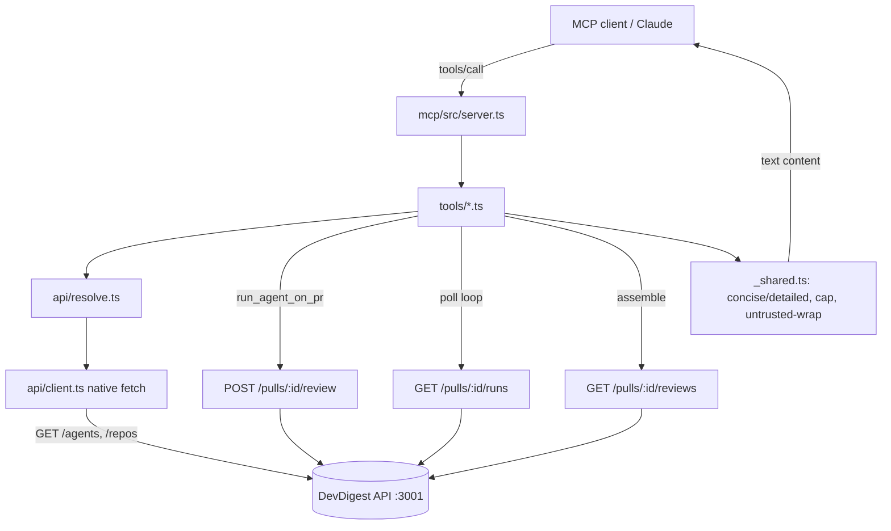

# Development Plan — Local MCP Server (`@devdigest/mcp`)

**Date:** 2026-08-23 · **Packages:** **new `mcp/`** (5th standalone package) · reads `server/src/vendor/shared` (source of truth) · does NOT modify `server/`, `client/`, `reviewer-core/`, `e2e/`
**Approach owner decisions (locked):** new standalone `mcp/` package · thin adapter over the HTTP API at `http://localhost:3001` · `run_agent_on_pr` blocks with polling + timeout fallback · flat args `repo="owner/name"`, `pr=number`, `agent=name`.

**Assumptions:**
- **`mcp/` is a standalone package like `reviewer-core/`** — own `package.json`, own lockfile, `type: module`, consumes shared Zod contracts through a tsconfig path alias to `../server/src/vendor/shared`, imports raw `.ts`, emits no JS. It is NOT added to any workspace. See §2.
- **The MCP server is a pure client of the existing HTTP API.** It performs no DB access, imports no `server/` internals, and duplicates no business logic. Every capability maps onto routes that already exist (verified in §3). The `server/` package stays the single owner of I/O and state (root `CLAUDE.md`).
- **This plan adds dependencies and therefore authorizes `npm install` inside `mcp/`** (`@modelcontextprotocol/sdk`, `zod`, and dev tooling — full list in §5 step 0). No other package gets an install.
- **Package manager: npm** with `package-lock.json`, matching `reviewer-core/` and `e2e/` (both npm). Rationale: `mcp/` is a pure contract-consumer with no Fastify/Drizzle/Next build scripts, so it avoids the pnpm build-allowlist friction noted in root `CLAUDE.md`.
- **Auth is a no-op locally.** `LocalNoAuthProvider` returns the single seeded workspace with no token/header (`server/src/adapters/auth/local.ts`), so the client sends plain `fetch`. An optional bearer is wired but unset by default for forward-compat. See §3.
- **The review pipeline is async fire-and-forget** (`server/CLAUDE.md` Gotchas; `reviews/routes.ts`, `run-executor.ts`). There is no synchronous run-and-return endpoint, so `run_agent_on_pr` composes start → poll → read. A missing provider key surfaces only via polling `GET /pulls/:id/runs` as `status:'failed'`, never as a synchronous error. This shapes step 6.

## 1. Scope

**In:**
- New package `mcp/` scaffold: `package.json` (`@devdigest/mcp`, private, ESM), `package-lock.json`, `tsconfig.json` (path alias `@devdigest/shared` → `../server/src/vendor/shared/index.ts`, plus local `zod`), `README.md`, `INSIGHTS.md`.
- **stdio MCP server** built on `@modelcontextprotocol/sdk` (`McpServer` + `StdioServerTransport`), declaring `capabilities.tools.listChanged`. All logging to **stderr only**.
- A **thin HTTP API client** (`src/api/client.ts`) over native `fetch` — the ONLY I/O in the package — with a typed error layer (`src/api/errors.ts`) and resolvers (`src/api/resolve.ts`) for `owner/name → repo.id`, `(repo, pr#) → pull.id`, `agent name → agentId`.
- **Five tools**, each registered with `registerTool` and a **Zod input schema** (flat args), `title`, `annotations`, and a 1–3 sentence description; `outputSchema` omitted on all (token budget, §4/§7-R1):
  1. `devdigest_list_agents` — `GET /agents`.
  2. `devdigest_run_agent_on_pr` — resolve → `POST /pulls/:id/review` → poll `GET /pulls/:id/runs` → assemble from `GET /pulls/:id/reviews`; blocks with timeout fallback.
  3. `devdigest_get_findings` — read findings for a completed run (by `run_id`, or `repo`+`pr`).
  4. `devdigest_get_conventions` — `GET /repos/:id/conventions?status=accepted`; **read-only, never triggers a scan**.
  5. `devdigest_get_blast_radius` — STUB; **not registered by default**, gated behind `MCP_ENABLE_BLAST_RADIUS`; returns `isError:true` "not_implemented" pointing to `get_findings`.
- **Concise/detailed response shaping** in `src/tools/_shared.ts`: concise findings `{severity, file, line, message}`, findings cap (default 25, severity-ordered) with a truncation note; `response_format` and `severity` accepted as validated strings (not enums). Third-party-derived content (findings, conventions) wrapped in an explicit untrusted marker.
- **Error-forward messages** on every failure path (unknown agent → list names + "call `devdigest_list_agents`"; bad `repo` → expected format; missing provider key → name provider + Settings path; PR not found → sync-window guidance; API unreachable → "start `./scripts/dev.sh`").
- **Token-budget regression test** asserting the serialized `tools/list` stays under budget.
- **Unit tests** (mock the API client) covering resolvers, every tool handler, the timeout fallback, the missing-key path, blast-radius gating, and the token budget. One optional `contract.it.test.ts` that self-skips when the API is unreachable.
- Docs: `mcp/README.md` (prereqs, MCP client config snippet, env vars, documented default-decisions), `mcp/INSIGHTS.md` (seed entry), and `specs/mcp-server.md` (feature spec matching the `specs/*.md` style).

**Out:**
- **No `list_repos` / `list_prs` tools** (deliberate — PR listing is covered by `gh pr list`; duplicating read endpoints as tools is an antipattern). No CRUD tools for agents/repos.
- **No changes to `server/`.** The known gaps (no ingest-by-number endpoint, no `run_id → pull` lookup, no token-missing signal from the sync endpoint) are recorded in §7 as API enhancements for the server owners — this plan works within them, it does not fix them.
- **No blast-radius implementation** — stub only.
- **No Streamable-HTTP transport / remote hosting** — stdio local only.
- **No editing of any `vendor/shared`** file (consumed read-only via alias).
- **No commits, pushes, or PRs.**

## 2. Affected surface

All new files under `mcp/` unless noted. Nothing under `server/`, `client/`, `reviewer-core/`, `e2e/`, or any `vendor/` path is modified.

| Package | File | What it is |
|---|---|---|
| mcp | `mcp/package.json` (new) | `@devdigest/mcp`, private, ESM; deps `@modelcontextprotocol/sdk`, `zod@^3.24.1`; devDeps `typescript`, `tsx`, `vitest`, `@types/node`, `@modelcontextprotocol/inspector`; scripts `dev/start/typecheck/test/inspect` |
| mcp | `mcp/package-lock.json` (new) | npm lockfile (own lockfile per package convention) |
| mcp | `mcp/tsconfig.json` (new) | ESM, `paths`: `@devdigest/shared` → `../server/src/vendor/shared/index.ts` (+ `/*`), local `zod` — mirror `reviewer-core/tsconfig.json` |
| mcp | `mcp/src/server.ts` (new) | stdio entrypoint: build `McpServer` (declare `tools.listChanged`), register enabled tools, `connect(new StdioServerTransport())` |
| mcp | `mcp/src/bootstrap.ts` (new) | build config + api client; register the 4 default tools (+ blast_radius when flagged) |
| mcp | `mcp/src/config.ts` (new) | env: `DEVDIGEST_API_URL` (=`http://localhost:3001`), `MCP_RUN_MAX_WAIT_MS` (=90000), `MCP_POLL_INTERVAL_MS` (=3000), `MCP_ENABLE_BLAST_RADIUS` (off), optional `DEVDIGEST_API_TOKEN` |
| mcp | `mcp/src/api/client.ts` (new) | native-`fetch` wrapper; typed methods for `/agents`, `/repos`, `POST /repos`, `/repos/:id/pulls`, `POST /pulls/:id/review`, `/pulls/:id/runs`, `/pulls/:id/reviews`, `/repos/:id/conventions` |
| mcp | `mcp/src/api/errors.ts` (new) | parse the API error envelope + HTTP status → typed `ApiError`; `ApiUnreachableError` |
| mcp | `mcp/src/api/resolve.ts` (new) | `resolveRepoId` (auto-add), `resolvePullId` (via sync), `resolveAgentId` (name, ambiguity handling); module-level `run_id → pull.id` map |
| mcp | `mcp/src/schemas.ts` (new) | per-tool Zod input schemas (flat); reuse `Severity`/`Verdict` from `@devdigest/shared` only for internal validation, not as tool-schema enums |
| mcp | `mcp/src/tools/list-agents.ts` (new) | handler |
| mcp | `mcp/src/tools/run-agent-on-pr.ts` (new) | handler (§5 step 6) |
| mcp | `mcp/src/tools/get-findings.ts` (new) | handler |
| mcp | `mcp/src/tools/get-conventions.ts` (new) | handler |
| mcp | `mcp/src/tools/get-blast-radius.ts` (new) | stub handler (gated) |
| mcp | `mcp/src/tools/_shared.ts` (new) | concise/detailed shaping, findings cap + note, `wrapUntrusted`, error-forward builders |
| mcp | `mcp/test/resolve.test.ts` (new) | unit — resolvers + error-forward strings |
| mcp | `mcp/test/tools.test.ts` (new) | unit — each handler against a mocked client |
| mcp | `mcp/test/token-budget.test.ts` (new) | unit — serialized `tools/list` under budget |
| mcp | `mcp/test/contract.it.test.ts` (new) | integration — drives the server over stdio/in-memory against a real API; self-skips when unreachable |
| mcp | `mcp/test/inspector.md` (new) | manual MCP-Inspector flows |
| mcp | `mcp/README.md`, `mcp/INSIGHTS.md` (new) | docs |
| repo | `specs/mcp-server.md` (new) | feature spec (matches `specs/*.md` narrative style) |

### Call sequence (data flow)

## 3. Constraints in force

| Constraint | Source | Effect on this plan |
|---|---|---|
| server owns all I/O and state | root `CLAUDE.md` | `mcp/` calls only the HTTP API; no DB, no `server/` imports, no logic duplication |
| standalone packages, own lockfile, raw-`.ts` via aliases, nothing published | root `CLAUDE.md` | `mcp/` mirrors `reviewer-core/`: own `package.json`/lockfile, `tsconfig` alias to `../server/src/vendor/shared`, no build/emit |
| `server/src/vendor/shared/` is the ONE source of truth for Zod contracts | root `CLAUDE.md` | consume `Severity`/`Verdict`/DTOs via the alias, **read-only**; never copy, never edit; do not touch the client mirror |
| review trigger is fire-and-forget; no timeout/queue | `server/CLAUDE.md` Gotchas | `run_agent_on_pr` must poll `GET /pulls/:id/runs` for terminal status; can't rely on a synchronous result |
| missing key → failed run, discovered by polling | `run-executor.ts:301-320`; `platform/container.ts` `ConfigError` | poll loop reads `runs[].status/error`; match `/_API_KEY is not configured/` → actionable message naming the provider |
| PR enters DB only via repo PR-sync; no ingest-by-number | `pulls/service.ts` `syncFromGitHub` | "auto-ingest" = add repo (if needed) then `GET /repos/:id/pulls` and match `number`; unmatched → error-forward |
| routes are at root, no `/api` prefix | `server/src/app.ts` | client base URL + path, e.g. `${DEVDIGEST_API_URL}/agents` |
| local auth is a no-op | `adapters/auth/local.ts`; `_shared/context.ts` | send no auth header by default; `api/client` accepts an optional bearer from config for forward-compat |
| secrets only via `SecretsProvider`; never in DB/git/logs | root `CLAUDE.md`; security skill | **never** accept API keys as tool arguments; never log request bodies that could carry secrets (none should) |
| stdio JSON-RPC breaks if anything writes stdout | MCP transport | all logs `console.error`/stderr; audit for stray `console.log` |
| `*.it.test.ts` for anything needing the running stack | root `CLAUDE.md`; `TESTING.md` | the API-dependent contract test carries `.it.test.ts` and self-skips when unreachable; unit tests are `*.test.ts`, no Docker |
| untrusted third-party content in prompts | security skill | findings/conventions text (from PR/repo) wrapped in an explicit `<untrusted_content …>` marker; never interpreted as instructions |
| `INSIGHTS.md` append-only | root `CLAUDE.md` | seed `mcp/INSIGHTS.md` with one new entry via `engineering-insights`; never edit existing entries elsewhere |

## 4. Skill contract

The implementer's default skill table does not cover a standalone client package; this section is authoritative for `mcp/`.

| Step | Skill | What it dictates here |
|---|---|---|
| 0 | `typescript-expert` | ESM + `NodeNext` module resolution; `tsconfig` alias depth correct (sibling of `server/`); strict types; no `any` in the client surface |
| 1, 6, 7 | `zod` | flat per-tool input schemas; `.describe()` only where non-obvious (`repo` format, `run_id` provenance); validate `response_format`/`severity`/`status` as `z.string()` + runtime check (no enum in schema — token budget); parse at the edge, hand typed values inward |
| 5 (client), 6 | `security` | never accept secrets as args; treat findings/conventions text as untrusted (`wrapUntrusted`); no auth token in logs; `fetch` targets only the configured base URL |
| 8 | `typescript-expert` | concise/detailed shaping types; exhaustive `Severity` ordering in the cap/sort |
| 4 (blast_radius) | `zod` | schema + handler written and unit-tested even though unregistered by default |
| all, before final report | `pr-self-review` | self-check the diff (stderr-only logging, no `outputSchema`, annotations present, no `server/` edits) — as a check, not a verdict |
| if a non-obvious lesson emerges | `engineering-insights` | write the `mcp/INSIGHTS.md` seed entry (and any surprise) through the skill; never hand-edit |

## 5. Steps

0. **Scaffold `mcp/` and authorize install.**
   - Files: `mcp/package.json`, `mcp/tsconfig.json` (new). Then `npm install` inside `mcp/` (this plan authorizes it — deps below).
   - Change: `package.json` `@devdigest/mcp`, `private:true`, `type:"module"`; deps `@modelcontextprotocol/sdk@^1`, `zod@^3.24.1`; devDeps `typescript@^5.7`, `tsx@^4.19`, `vitest@^2.1`, `@types/node@^22`, `@modelcontextprotocol/inspector`; scripts `dev`(`tsx watch src/server.ts`), `start`(`tsx src/server.ts`), `typecheck`(`tsc --noEmit -p tsconfig.json`), `test`(`vitest run --passWithNoTests`), `inspect`(`mcp-inspector tsx src/server.ts`). `tsconfig.json` copies `reviewer-core/tsconfig.json`, setting `paths`: `@devdigest/shared` → `["../server/src/vendor/shared/index.ts"]`, `@devdigest/shared/*` → `["../server/src/vendor/shared/*"]`, local `zod`. **Pin the same `zod` version reviewer-core uses** (verify in `reviewer-core/package.json`).
   - Skill: `typescript-expert`.
   - Done when: `cd mcp && npm install` succeeds; `npm run typecheck` runs (may report only the empty entrypoint).
   - Depends on: —

1. **Config + walking-skeleton server + `list_agents` end-to-end.**
   - Files: `mcp/src/config.ts`, `mcp/src/api/client.ts` (just `getAgents`), `mcp/src/schemas.ts` (list_agents = no inputs), `mcp/src/tools/list-agents.ts`, `mcp/src/bootstrap.ts`, `mcp/src/server.ts` (new).
   - Change: read env in `config.ts`. `client.getAgents()` → `GET ${base}/agents`. `list-agents` handler returns `{agents:[{name,description,provider,model,enabled}]}` as JSON text content, `readOnlyHint:true, openWorldHint:false, idempotentHint:true`, `title:"List review agents"`. `server.ts` builds `McpServer` with `capabilities:{tools:{listChanged:true}}`, registers via `bootstrap`, connects `StdioServerTransport`. **All logging via `console.error`.**
   - Skill: `zod`, `typescript-expert`.
   - Done when: `npm run typecheck` clean; `npm run inspect` shows one tool and `devdigest_list_agents` returns seeded agents against a running API (manual, documented in `test/inspector.md`).
   - Depends on: 0

2. **API client (full) + typed errors.**
   - Files: `mcp/src/api/client.ts` (extend), `mcp/src/api/errors.ts` (new).
   - Change: typed methods for every endpoint the tools need (see §2 client row). `errors.ts`: on non-2xx, parse the API error envelope (inspect an actual error response shape from `server/src/platform/errors.ts`) into `ApiError{status,message}`; wrap `fetch` network failures as `ApiUnreachableError` carrying the base URL. Optional bearer from `config` (unset by default).
   - Skill: `typescript-expert`, `security` (no secret logging).
   - Done when: `npm run typecheck` clean; unit test (step 9) exercises error mapping.
   - Depends on: 1

3. **Resolvers.**
   - Files: `mcp/src/api/resolve.ts` (new).
   - Change: `resolveRepoId(owner/name)` — `GET /repos`, case-insensitive `full_name` match; if absent `POST /repos {url:"https://github.com/owner/name"}` and use returned id. `resolvePullId(repoId, pr)` — `GET /repos/:repoId/pulls` (triggers sync), find `number===pr`; absent → `PrNotFoundError` (error-forward text: closed/merged outside sync window, or repo not added). `resolveAgentId(name)` — `GET /agents`; exact-case match first, else case-insensitive; 0 → `UnknownAgentError` listing available names; >1 → `AmbiguousAgentError`. Module-level `Map<run_id, pull_id>` with `rememberRun`/`lookupPull`.
   - Skill: `typescript-expert`, `security`.
   - Done when: `npm run typecheck` clean; unit tests assert exact error-forward strings.
   - Depends on: 2

4. **Shared shaping + error-forward helpers.**
   - Files: `mcp/src/tools/_shared.ts` (new).
   - Change: `shapeFindings(findings, {format, severity})` → concise `{severity, file, line, message}` (line = `start_line`, append `-end_line` only if end>start; message = `title`); detailed adds `rationale, suggestion, category, confidence`; severity filter; cap at `FINDINGS_CAP=25` sorted `CRITICAL>WARNING>SUGGESTION`, returning `{items, truncated_note?}`. `wrapUntrusted(source, text)` → `<untrusted_content source="…">…</untrusted_content>`. `toolError(message)` → an `isError:true` content result. `okJson(obj)` → text content.
   - Skill: `typescript-expert`, `zod` (reuse `Severity` ordering from `@devdigest/shared`).
   - Done when: `npm run typecheck` clean; unit-tested via step 9.
   - Depends on: 2

5. **`get_findings` + `get_conventions` (read tools).**
   - Files: `mcp/src/tools/get-findings.ts`, `mcp/src/tools/get-conventions.ts`, `mcp/src/schemas.ts` (extend), `mcp/src/bootstrap.ts` (register).
   - Change:
     - `get_findings` inputs `{run_id?, repo?, pr?, response_format="concise", severity?}`; require `run_id` OR `repo`+`pr` (else error-forward). Resolve pull (from the `run_id→pull` map, else via `repo`+`pr`). Read `GET /pulls/:id/reviews`; filter by `run_id` when given; if the run is still running/failed (cross-check `GET /pulls/:id/runs`) return status guidance, not findings. Shape via `_shared`. `readOnlyHint:true, idempotentHint:true`.
     - `get_conventions` inputs `{repo, status="accepted"}`; resolve repo; `GET /repos/:id/conventions?status=`; return `{repo, scan_status, conventions:[…]}` **wrapped untrusted**; never scanned → error-forward ("run a scan in the DevDigest UI first"); **never POST a scan**. `readOnlyHint:true, idempotentHint:true`.
   - Skill: `zod`, `security` (untrusted-wrap), `typescript-expert`.
   - Done when: `npm run typecheck` clean; Inspector shows both tools; unit tests (step 9) cover shaping, severity filter, cap note, and each error-forward path.
   - Depends on: 3, 4

6. **`run_agent_on_pr` (start + poll + assemble).**
   - Files: `mcp/src/tools/run-agent-on-pr.ts`, `mcp/src/schemas.ts` (extend), `mcp/src/bootstrap.ts` (register).
   - Change: inputs `{repo, pr, agent, response_format="concise", severity?, max_wait_ms?}`. (1) validate `repo` `^[^/]+/[^/]+$`, `pr` positive int → error-forward on bad format. (2) `resolveRepoId`. (3) `resolvePullId`. (4) `resolveAgentId`. (5) `POST /pulls/:pullId/review {agentId}` → `run_id = runs[0].run_id`; `rememberRun(run_id, pullId)`. (6) poll every `MCP_POLL_INTERVAL_MS` until deadline `max_wait_ms ?? MCP_RUN_MAX_WAIT_MS`: `GET /pulls/:pullId/runs`, find `run_id`; `running`→continue; `failed`→read `error`, if `/_API_KEY is not configured/` emit actionable missing-key `isError` naming the provider, else surface `error` as `isError`; `done`→break; deadline reached while running → **return SUCCESS** `{run_id, status:"running", repo, pr, resume_with:"devdigest_get_findings", note}`. (7) `GET /pulls/:pullId/reviews`, filter `run_id`, shape concise, apply severity filter + cap; return `{run_id, status:"done", verdict, score, findings[], truncated_note?}`; done-but-no-review → verdict/score with empty findings + "reviewed, clean" note. `readOnlyHint:false, openWorldHint:true, destructiveHint:false, idempotentHint:false`, `title:"Run a review agent on a PR"`.
   - Skill: `zod`, `security` (untrusted findings), `typescript-expert`.
   - Done when: `npm run typecheck` clean; Inspector happy path returns findings; forcing `max_wait_ms` low returns the running/resume result; removing `OPENROUTER_API_KEY` yields the actionable missing-key message.
   - Depends on: 3, 4, 5

7. **`get_blast_radius` stub + `listChanged` gating.**
   - Files: `mcp/src/tools/get-blast-radius.ts`, `mcp/src/schemas.ts` (extend), `mcp/src/bootstrap.ts` (gate on `MCP_ENABLE_BLAST_RADIUS`), `mcp/src/config.ts` (flag).
   - Change: inputs `{repo, pr}`; handler returns `isError:true` "not_implemented … see affected files via `devdigest_get_findings`". **Registered only when the flag is set**; when it flips on, the server already declares `tools.listChanged` (step 1) and emits `notifications/tools/list_changed`. `readOnlyHint:true, openWorldHint:false`.
   - Skill: `zod`.
   - Done when: default `tools/list` shows 4 tools; with `MCP_ENABLE_BLAST_RADIUS=1` it shows 5 and the call returns the not-implemented result; unit-tested.
   - Depends on: 1

8. **Hardening: stderr-only, unreachable-API, annotations audit.**
   - Files: touch as needed across `mcp/src/**`.
   - Change: audit — no `console.log` anywhere (grep); top-level catch renders `ApiUnreachableError` as the "start `./scripts/dev.sh`" error-forward result for every tool; confirm all five tools set `title` + annotations per §2/§5 and omit `outputSchema`.
   - Skill: `pr-self-review`, `security`.
   - Done when: `rg "console\.log" mcp/src` returns nothing; `npm run typecheck` clean.
   - Depends on: 5, 6, 7

9. **Tests (unit + optional contract) — see §6.**
   - Files: `mcp/test/resolve.test.ts`, `mcp/test/tools.test.ts`, `mcp/test/token-budget.test.ts`, `mcp/test/contract.it.test.ts`, `mcp/test/inspector.md` (new).
   - Change: unit tests mock the API client and assert resolver behavior + exact error-forward strings; every tool handler (shaping, severity filter, cap note, run/timeout/missing-key paths, blast-radius gating); `token-budget.test.ts` builds the server, serializes the registered `tools/list`, asserts `approxTokens(json) <= BUDGET` (chars/4 heuristic, no tiktoken dep). `contract.it.test.ts` drives the server over stdio/in-memory against a real API and **self-skips when `DEVDIGEST_API_URL` is unreachable**.
   - Skill: `TESTING.md` conventions (`*.it.test.ts` suffix for the API-dependent test).
   - Done when: `cd mcp && npm run test` passes (contract test self-skips without a running API).
   - Depends on: 3, 4, 5, 6, 7

10. **Docs + spec.**
    - Files: `mcp/README.md`, `mcp/INSIGHTS.md`, `specs/mcp-server.md` (new).
    - Change: `README.md` — prereq (API running + migrated + seeded), MCP client config JSON snippet (`command: npx, args:["-y","tsx","<abs>/mcp/src/server.ts"], env:{DEVDIGEST_API_URL}`), env-var table, and the documented default-decisions & limitations from §7. `specs/mcp-server.md` — read one existing `specs/*.md` first for style; cover Context / What we're building / Decisions / tool table / `run_agent_on_pr` flow / open questions. Seed `mcp/INSIGHTS.md` via `engineering-insights`.
    - Skill: `engineering-insights` (INSIGHTS entry).
    - Done when: files exist; README config snippet is copy-pasteable.
    - Depends on: 9

## 6. Test strategy

| What | Lane | File | Command (from `mcp/`) |
|---|---|---|---|
| Resolvers + error-forward strings | unit (no Docker) | `mcp/test/resolve.test.ts` | `npm run test` |
| Every tool handler (shaping, filter, cap, run/timeout/missing-key, blast gating) | unit | `mcp/test/tools.test.ts` | `npm run test` |
| `tools/list` under token budget | unit | `mcp/test/token-budget.test.ts` | `npm run test` |
| Server↔API end-to-end over stdio | integration (needs running API) | `mcp/test/contract.it.test.ts` | `npm run test` (self-skips if `DEVDIGEST_API_URL` unreachable) |

Typecheck: `cd mcp && npm run typecheck`.
No Docker and no LLM are stood up in `mcp/` tests — the API owns that. The contract test is the only stack-dependent test; it self-skips (report it as **skipped**, never as passed, when the API is down).

## 7. Risks & open questions

| # | Question | Default if unanswered | Blocks step |
|---|---|---|---|
| R1 | Register `get_blast_radius` now (discoverable) vs gate it behind a flag (token-free)? | **Gate behind `MCP_ENABLE_BLAST_RADIUS`, unregistered by default** (schema+handler still written & tested); expose later via `listChanged`. Saves ~150–250 tokens/message. | 7 |
| R2 | Review non-open (merged/closed) PRs? | **Out of scope** — resolution failure returns the "closed/merged outside sync window" error-forward. A real ingest-by-number endpoint is a server-side enhancement, not in this plan. | 6 |
| R3 | No `GITHUB_TOKEN` → sync silently finds nothing; can the tool detect it? | **No** — the list endpoint does not expose the token-missing case. Treat as ordinary "PR not found"; document the limitation in README. Possible future server signal. | 3, 6 |
| R4 | Duplicate agent names (no unique constraint)? | **Error on ambiguity** (do not auto-pick); ask the user to rename in DevDigest. | 3, 6 |
| R5 | `run_id → pull.id` map is in-memory/process-scoped — lost on restart. | `get_findings({run_id})` **falls back to requiring `repo`+`pr`** when the map lacks the id. Document; a server-side `run_id → pull` lookup would remove the need. | 3, 5 |
| R6 | `response_format`/`severity`/`status` as free strings vs enums? | **Free `z.string()` + validate + teach via error** (token budget). | 5, 6 |
| R7 | `POST /pulls/:id/review` is rate-limited (10/min) and job concurrency is 3 process-wide. | Surface a 429 as an error-forward "slow down / try again shortly" message; do not retry automatically. | 6 |
| R8 | Exact API error envelope shape for `errors.ts` mapping. | Inspect `server/src/platform/errors.ts` and one live error response; map `{status, message}` conservatively, fall back to raw text. | 2 |

## 8. Acceptance criteria

- [ ] `mcp/` is a standalone package with its own `package.json` + `package-lock.json`, `type:"module"`, and a `tsconfig.json` whose `@devdigest/shared` alias resolves to `../server/src/vendor/shared/index.ts`; `cd mcp && npm run typecheck` is clean. No file under `server/`, `client/`, `reviewer-core/`, `e2e/`, or any `vendor/` path is modified (`git diff --name-only` shows only `mcp/**` and `docs/plans/**` and `specs/mcp-server.md`).
- [ ] The server registers **exactly 4 tools by default** (`devdigest_list_agents`, `devdigest_run_agent_on_pr`, `devdigest_get_findings`, `devdigest_get_conventions`); with `MCP_ENABLE_BLAST_RADIUS=1` it registers a 5th and declares `tools.listChanged`.
- [ ] Every tool sets `title` and annotations, omits `outputSchema`, and uses flat Zod input args; `response_format`/`severity`/`status` are validated strings, not schema enums.
- [ ] `devdigest_list_agents` returns seeded agents `{name,description,provider,model,enabled}` against a running API.
- [ ] `devdigest_run_agent_on_pr` resolves `owner/name`+`pr`+agent-name, starts a run, polls `GET /pulls/:id/runs`, and returns `{run_id, verdict, score, findings[]}`; on `max_wait` it returns `{status:"running", resume_with:"devdigest_get_findings"}` as a **success**; a missing provider key yields an actionable message naming the provider (not a raw 500).
- [ ] `devdigest_get_findings` works by `run_id` and by `repo`+`pr`, filters by severity, and caps with a truncation note; a still-running run returns status guidance, not findings.
- [ ] `devdigest_get_conventions` reads `?status=accepted` and **never** POSTs a scan; never-scanned repos return the "run a scan in the UI" error-forward; returned rules are wrapped in an untrusted marker.
- [ ] `devdigest_get_blast_radius` (when enabled) returns an `isError:true` "not_implemented" result pointing to `get_findings`.
- [ ] Error-forward messages exist for: unknown agent (lists names), bad `repo` format, PR not found (sync-window guidance), ambiguous agent name, and API unreachable ("start `./scripts/dev.sh`").
- [ ] `rg "console\.log" mcp/src` returns nothing (stdio-safe, stderr-only logging).
- [ ] `mcp/test/token-budget.test.ts` asserts the serialized default `tools/list` is under the budget constant and passes.
- [ ] `cd mcp && npm run test` passes; `contract.it.test.ts` self-skips (reported as skipped) when the API is unreachable.
- [ ] `mcp/README.md` documents prereqs, a copy-pasteable MCP client config, env vars, and the R2–R5 default-decisions/limitations; `specs/mcp-server.md` and a seed `mcp/INSIGHTS.md` entry exist.
