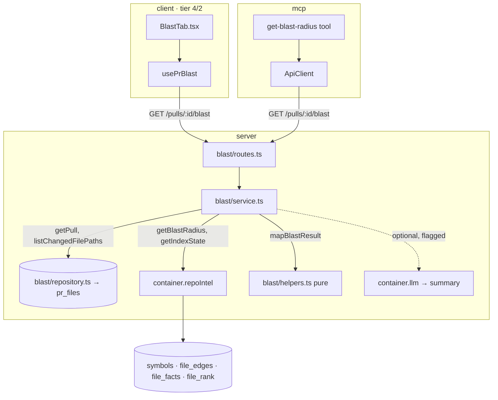

# Development Plan — Blast Radius (impact map for a PR)

**Date:** 2026-08-24 · **Packages:** server / client / mcp (the existing untracked `mcp/` package) · reviewer-core: **not touched**
**Assumptions (settled without asking — exactly one plausible reading each):**
- **The core analysis needs no model and no new index work.** `container.repoIntel.getBlastRadius(repoId, changedFiles)` already exists (`server/src/modules/repo-intel/service.ts:225`, declared `server/src/modules/repo-intel/types.ts:147`) and already returns changed symbols, callers (with `rank`, `viaSymbol`, and the declaration file already excluded), a flat `impactedEndpoints`, and per-caller-file `factsByFile.{endpoints,crons}`. This feature is a **read + shape** layer over that facade; it does not add a table, migration, or indexer change.
- **The wire contract already exists** as `BlastRadius` in `server/src/vendor/shared/contracts/brief.ts:57` (and is exported from `@devdigest/shared`). The server route returns that shape; the new module's job is mapping `BlastResult` (facade) → `BlastRadius` (wire). The client mirror `client/src/vendor/shared/contracts/brief.ts:57` is **already in sync for `BlastRadius`** (verified: identical `changed_symbols`/`downstream`/`summary`), so no re-sync is needed unless the contract changes — see step 1.
- **Changed files come from the persisted `pr_files` table**, read from the new module's own `repository.ts` (the smart-diff precedent, `smart-diff/repository.ts:43`), not from a fresh GitHub call. This keeps the route cheap and offline-friendly.
- **The optional one-paragraph model summary is IN scope but behind a flag**, off by default (like intent's cheap classifier). When off, `summary` is a deterministic string. Nodes/links are never model-derived. See step 5 and R1.
- **`repoId` is resolved from the PR**, not passed by the client: the route is `GET /pulls/:id/blast`, the service loads the pull (tenancy gate), reads `pull.repoId`, and calls the facade with it — mirroring intent/smart-diff.
- **The Blast tab is a 4th tab** (`overview` · `findings` · `diff` · **`blast`**) on the existing PR detail page, following the intent/`IntentCard` presentation precedent.

## 1. Scope

**In:**
- New server module `modules/blast/` (`routes.ts`, `service.ts`, `repository.ts`, `constants.ts`, `helpers.ts`) exposing `GET /pulls/:id/blast` → `BlastRadius`, plus a `partial`/`degraded` signal.
- Deterministic mapping `BlastResult` → `BlastRadius`: group callers by changed symbol, cap at 20 callers/symbol sorted by `rank` desc, attribute endpoints/crons per symbol from `factsByFile`, and surface `degraded`/`partial`.
- Optional single cheap LLM call producing the one-paragraph `summary`, gated by a feature flag; deterministic fallback string when disabled or on any failure.
- A **`partial`/`degraded` state on the contract** so an incomplete index is never masked by an empty array (spec item 6). This is a small additive field on `BlastRadius` (`index_state`) in `server/src/vendor/shared/contracts/brief.ts`, re-synced to the client mirror.
- Client: a **Blast tab** on the PR detail page — changed symbols (with caller counts) → caller tree of clickable `file:line` locations → endpoint chips (GET/POST) and cron chips; a "degraded/partial index" notice when the state is not `full`; a "Prior PRs touching these files" section (data already available via smart-diff's `pr_files` / PR history — see step 9 and R4). A new data hook `usePrBlast`, a query-key entry, and one component folder.
- `mcp/`: replace the `devdigest_get_blast_radius` **stub** (`mcp/src/tools/get-blast-radius.ts`) with a real handler that calls the same server route through the existing `ApiClient`, shaping and untrusted-wrapping the result. Register it by default or keep it flag-gated per the existing MCP plan — see R1.
- Tests: server unit (mapping + degraded), server integration (`.it.test.ts`, route + facade over a seeded DB), client component test, mcp unit test.

**Out:**
- **No indexer / migration / new table.** The facade and its tables (`symbols`, `file_edges`, `file_facts`, `file_rank`) already exist; an empty/partial index is a *state to report*, not a bug to fix (`server/docs/db-model.md`; root `CLAUDE.md` "empty table is not a bug").
- **No reviewer-core change.** Blast is a studio/API read feature; the engine already gets its high-blast-radius note separately (`reviews/run-executor.ts:460`).
- **No change to `getBlastRadius` facade internals.** If the mapping needs a datum the facade does not expose, prefer a new module-local `repository.ts` read (the documented layering smell, `server/INSIGHTS.md` 2026-08-08) over bloating the facade — but the current `BlastResult` already carries everything the `BlastRadius` contract needs.
- **No caller/endpoint invention by the model.** The optional LLM call writes only `summary`.
- **No 2nd/3rd-level import-graph traversal beyond what the facade returns.** Spec item 5 ("limit traversal to two levels") is already the facade's behaviour (resolved callers, one hop); this plan does not add a second BFS layer — see R2.

## 2. Affected surface

| Package | Layer | File | What changes |
|---|---|---|---|
| server | ring 1 · contract | `server/src/vendor/shared/contracts/brief.ts:57-62` | add `index_state: BlastIndexState` (a small enum-backed object: `status`, optional `reason`) to `BlastRadius`; **source of truth** |
| server | ring 4 · entry | `server/src/modules/index.ts:13,40` | one import + one registry entry: `blast` |
| server | ring 4 · entry | `server/src/modules/blast/routes.ts` (new) | `GET /pulls/:id/blast` → `BlastRadius`; transport only (`getContext` → one service call) |
| server | ring 2 · application | `server/src/modules/blast/service.ts` (new) | load pull (tenancy), read changed files, call `container.repoIntel.getBlastRadius`, read `getIndexState`, map → `BlastRadius`, optional LLM summary |
| server | ring 3 · infra | `server/src/modules/blast/repository.ts` (new) | the module's only drizzle site: `getPull(workspaceId, prId)` + `listChangedFilePaths(prId)` from `pr_files` |
| server | ring 2 · pure | `server/src/modules/blast/helpers.ts` (new) | pure `mapBlastResult(result, indexState): BlastRadius` — grouping, 20-cap sort, endpoint/cron attribution, deterministic summary |
| server | ring 2 · literals | `server/src/modules/blast/constants.ts` (new) | `MAX_CALLERS_PER_SYMBOL=20`, `BLAST_SUMMARY_FEATURE`, flag name, default summary text |
| client | tier 0 · vendor | `client/src/vendor/shared/contracts/brief.ts` | **re-sync** the `BlastRadius` + new `BlastIndexState` after the server contract changes (hand-synced copy; TS will not flag drift — `client/CLAUDE.md` Gotchas) |
| client | tier 2 · access | `client/src/lib/query-keys.ts:66-79` | add `blast: ["pr", prId, "blast"]` under `qk.pr(prId)` |
| client | tier 2 · access | `client/src/lib/hooks/reviews.ts` or new `client/src/lib/hooks/blast.ts` | `usePrBlast(prId)` → `GET /pulls/:id/blast` |
| client | tier 2 · access | `client/src/lib/types.ts:35` | re-export `BlastRadius` (+ new sub-types) from `@devdigest/shared` |
| client | tier 4 · route | `client/src/app/repos/[repoId]/pulls/[number]/_components/PrDetailHeader/PrDetailHeader.tsx:100-108` | add a 4th tab `{ key:"blast", label:"Blast", icon:… , count: symbolCount }` |
| client | tier 4 · route | `client/src/app/repos/[repoId]/pulls/[number]/page.tsx:77-108` | render `<BlastTab prId repoFullName headSha />` when `vm.tab === "blast"` |
| client | tier 4 · route | `client/src/app/repos/[repoId]/pulls/[number]/_components/BlastTab/**` (new folder) | `BlastTab.tsx` + `index.ts` + `styles.ts` + `constants.ts` + `helpers.ts` + `BlastTab.test.tsx` |
| mcp | tool | `mcp/src/tools/get-blast-radius.ts` (rewrite) | call `client.getBlastRadius(pullId)` via resolvers, shape + untrusted-wrap |
| mcp | client/schema | `mcp/src/api/client.ts`, `mcp/src/bootstrap.ts` | add `getBlastRadius` method; register the tool (see R1) |

### Data flow

## 3. Constraints in force

| Constraint | Source | Effect on this plan |
|---|---|---|
| routes are transport only; no logic, no SQL | `server/CLAUDE.md` "Layer discipline"; onion O5 | `blast/routes.ts` is `getContext` → one `service.forPull` call → return; mirror `smart-diff/routes.ts` |
| `service.ts` holds no HTTP and no raw SQL | `server/CLAUDE.md`; O4 | changed-files + tenancy reads go through `blast/repository.ts`; facade/LLM through `container` |
| `repository.ts` is the module's only drizzle site; modules don't import a sibling's data layer | onion O6/O7; `server/INSIGHTS.md` 2026-08-08 | read `pr_files` (a pulls table) from `blast/repository.ts` directly, as smart-diff/conventions do; do **not** import `PullsRepository` or `repo-intel` internals |
| repo-intel facade methods must degrade, never throw; `[]`/`degraded:true` is the fallback | `server/CLAUDE.md`; `repo-intel/types.ts:15-22` | the service treats `degraded`/`partial`/empty as data; it must **not** turn a degraded result into an empty `BlastRadius` — it sets `index_state` so the client can explain (spec item 6) |
| `server/src/vendor/shared/` is the ONE source of truth for Zod contracts; client copy drifts silently | root `CLAUDE.md`; `client/CLAUDE.md` Gotchas | change `BlastRadius` in the server contract first, then hand-re-sync the client mirror (step 8) |
| add a module = one import + one entry in `modules/index.ts`; static registry | `server/CLAUDE.md`; `modules/index.ts:15-27` | register `blast` there, nowhere else |
| secrets only via `SecretsProvider`; the LLM summary must resolve model/provider via settings | root `CLAUDE.md`; intent precedent `intent/service.ts:98-99` | the optional summary uses `SettingsService.resolveFeatureModel` + `container.llm(provider)`; never reads `process.env` for a key |
| untrusted third-party text in prompts/outputs | security skill; reviewer-core `<untrusted>` convention | symbol/file names and any LLM summary that echoes repo content are wrapped `<untrusted_content>` in the mcp tool output; the client renders them as text, never as HTML |
| a DB-backed test must be `*.it.test.ts` | root `CLAUDE.md`; `TESTING.md` | the route+facade test is `blast.it.test.ts`; the pure-mapping test is `helpers.test.ts` (no Docker) |
| client tiers, downward only; no key literal or `invalidateQueries` in a component | `client/CLAUDE.md`; C1/C14/C15 | hook in `src/lib/hooks/*`, key in `query-keys.ts`, `BlastTab` consumes the hook; page.tsx stays a composition root (C3) |
| one component = one folder; every visible string via `useTranslations` | `client/CLAUDE.md`; C4/C10 | `BlastTab/` carries its segments; tab label + section headings + empty/degraded copy go through `messages/en/prReview.json`, not literals in `.tsx`/`constants.ts` |
| `INSIGHTS.md` append-only | root `CLAUDE.md` | any learning is a new dated entry via `engineering-insights`; never edit existing |

## 4. Skill contract

| Step | Skill | What it dictates here |
|---|---|---|
| 1 | `zod` | add `BlastIndexState` (an object with a small `status` enum + optional `reason`) to `BlastRadius`; export the schema **and** the inferred type; keep it a plain object contract (do not derive from a Drizzle table — O8) |
| 2, 3 | `onion-architecture` | `repository.ts` = only drizzle site; `service.ts` no SQL/HTTP; read `pr_files` locally, not via the sibling repo (O6/O7) |
| 4 | `typescript-expert` | pure `mapBlastResult`: exhaustive grouping by `viaSymbol`, `rank`-desc sort, `slice(0,20)`; total types over the `BlastResult` union incl. `factsByFile?` optional |
| 3 | `fastify-best-practices` | route via `ZodTypeProvider`, `IdParams`, no `response` schema (repo convention — smart-diff/routes.ts comment); rely on the global rate limit, no LLM-cost concern when the flag is off |
| 5 | `security` | the optional summary prompt feeds only file/symbol names + counts (no diff bodies); resolve the key via settings, never log it |
| 6 | `client-architecture` | tab is route-private under the PR route; `usePrBlast` in `src/lib/hooks`; key from the factory; `page.tsx` stays thin |
| 6 | `next-best-practices` / `react-best-practices` | `BlastTab` is `"use client"`, derives display values (caller counts) during render — no `useEffect`-derived state; clickable `file:line` reuses `githubBlobUrl` (`client/src/lib/github-urls.ts`) |
| 7 (client) | `react-testing-library` | one `BlastTab.test.tsx` flow: mock the hook/`fetch`, assert a symbol → caller `file:line` link with the right `href`, an endpoint chip, and the degraded notice |
| 9 (mcp) | `zod`, `security` | reuse the existing mcp shaping/`wrapUntrusted`; flat args (`repo`, `pr`); no `outputSchema` (mcp token-budget rule) |
| wrap-up | `engineering-insights` | record any non-obvious trap (e.g. facade returns `impactedEndpoints` flat but the contract wants per-symbol attribution) as a new dated entry |

## 5. Steps

1. **Extend the `BlastRadius` contract with an index-state signal.**
   - Package · layer: server · ring 1 (`vendor/shared`).
   - Files: `server/src/vendor/shared/contracts/brief.ts:57-62` (edit).
   - Change: add `export const BlastIndexState = z.object({ status: z.enum(['full','partial','degraded','failed']), reason: z.string().nullish() })` and a field `index_state: BlastIndexState` on `BlastRadius`. Export the type. Keep `changed_symbols`/`downstream`/`summary` unchanged. This is what lets the client show partial/degraded instead of an empty array (spec item 6). Do **not** touch the client mirror yet (step 8).
   - Skill: `zod`.
   - Done when: `cd server && pnpm typecheck` is clean; `@devdigest/shared` re-exports the new type.
   - Depends on: —

2. **Blast repository — changed files + tenancy gate.**
   - Package · layer: server · ring 3.
   - Files: `server/src/modules/blast/repository.ts` (new), `server/src/modules/blast/constants.ts` (new).
   - Change: `class BlastRepository { getPull(workspaceId, prId): Promise<PullRow|undefined>` (tenancy gate, copy `smart-diff/repository.ts:30-36`); `listChangedFilePaths(prId): Promise<string[]>` selecting `t.prFiles.path where prId` (copy `smart-diff/repository.ts:43-52`, path only) }. `constants.ts`: `MAX_CALLERS_PER_SYMBOL = 20`, `BLAST_SUMMARY_FEATURE = 'blast_summary'`, `BLAST_SUMMARY_ENABLED` flag reference, `DEFAULT_BLAST_SUMMARY` text.
   - Skill: `onion-architecture`, `drizzle-orm-patterns`.
   - Done when: `pnpm typecheck` clean; repository imports only `db/*`.
   - Depends on: —

3. **Pure mapping helper `BlastResult` → `BlastRadius`.**
   - Package · layer: server · ring 2 (pure).
   - Files: `server/src/modules/blast/helpers.ts` (new).
   - Change: `mapBlastResult(result: BlastResult, indexState: IndexState): BlastRadius`:
     - `changed_symbols` ← `result.changedSymbols` mapped to `{name,file,kind}`.
     - Group `result.callers` by `viaSymbol`; per group build `DownstreamImpact{ symbol, callers: BlastCaller[] (name←caller.symbol, file, line), endpoints_affected, crons_affected }`. Sort each group's callers by `rank` desc and `slice(0, MAX_CALLERS_PER_SYMBOL)` (spec item 4; declaration file already excluded by the facade). Attribute endpoints/crons from `result.factsByFile[callerFile]` unioned across the group's caller files (fall back to `result.impactedEndpoints` for the whole map when `factsByFile` is absent on the degraded path).
     - `summary` ← `DEFAULT_BLAST_SUMMARY` (deterministic; the LLM overwrites it in step 5 when enabled).
     - `index_state` ← `{ status: indexState.status, reason: indexState.degradedReason ?? indexState.reason ?? null }`. A `degraded`/`partial`/empty facade result yields a populated `index_state`, **never** a silently-empty payload (spec item 6).
   - Skill: `typescript-expert`.
   - Done when: `pnpm typecheck` clean; unit-tested in step 7.
   - Depends on: 1.

4. **Blast service — orchestrate load → facade → map.**
   - Package · layer: server · ring 2.
   - Files: `server/src/modules/blast/service.ts` (new).
   - Change: `class BlastService { forPull(workspaceId, prId, log?): Promise<BlastRadius> }`. Impure→pure→(optional impure): (a) `repo.getPull` (404 via `NotFoundError` if absent); (b) `repo.listChangedFilePaths(prId)`; (c) `container.repoIntel.getBlastRadius(pull.repoId, files)` and `container.repoIntel.getIndexState(pull.repoId)` (facade never throws — no try/catch needed, but treat empty as data); (d) `mapBlastResult(...)`; (e) if the summary flag is on, call the optional LLM summary (step 5) and overwrite `summary`, wrapping any failure in a fallback to the deterministic string. No SQL, no HTTP, no drizzle here.
   - Skill: `onion-architecture`.
   - Done when: `pnpm typecheck` clean.
   - Depends on: 2, 3.

5. **Optional one-paragraph model summary (flag-gated).**
   - Package · layer: server · ring 2 (impure edge inside the service).
   - Files: `server/src/modules/blast/service.ts` (extend), `server/src/modules/blast/constants.ts` (system prompt), `server/src/modules/settings/*` (only if a new feature slug must be registered — check `intent/constants.ts:INTENT_FEATURE` and the settings feature list first).
   - Change: private `summarize(workspaceId, map): Promise<string>` — build a prompt from **counts and names only** (N changed symbols, top callers, endpoint/cron lists) — never diff bodies (mirror `intent/service.ts` discipline). `resolveFeatureModel(workspaceId, BLAST_SUMMARY_FEATURE)` → `container.llm(provider)` → a plain-text completion. On any error or when the flag is off, keep `DEFAULT_BLAST_SUMMARY`. The nodes/links are already fixed by step 3; the model only writes prose (spec "the model never invents nodes/links").
   - Skill: `security` (no secret in logs, no untrusted content executed).
   - Done when: with the flag off, `forPull` makes **zero** LLM calls (assert in step 7 with a `MockLLMProvider`); with it on, `summary` is the model's text or the fallback.
   - Depends on: 4.

6. **Route + registration.**
   - Package · layer: server · ring 4.
   - Files: `server/src/modules/blast/routes.ts` (new), `server/src/modules/index.ts:13,40` (edit).
   - Change: `GET /pulls/:id/blast` with `schema: { params: IdParams }`, `getContext` → `service.forPull(workspaceId, req.params.id, app.log)` → `Promise<BlastRadius>`; no `response` schema (repo convention). Add `import blast from './blast/routes.js'` and `blast` to the `modules` registry.
   - Skill: `fastify-best-practices`, `onion-architecture` (O5).
   - Done when: route boots; `pnpm typecheck` clean; manual `GET /pulls/<id>/blast` returns a `BlastRadius`.
   - Depends on: 4 (and 5 for the summary field).

7. **Server tests (unit + integration).**
   - Package · layer: server.
   - Files: `server/src/modules/blast/helpers.test.ts` (new, unit), `server/src/modules/blast/blast.it.test.ts` (new, integration).
   - Change: `helpers.test.ts` — pure `mapBlastResult`: (a) grouping by `viaSymbol`; (b) 20-caller cap with `rank`-desc order; (c) endpoint/cron attribution from `factsByFile`; (d) a `degraded`/empty `BlastResult` still yields a populated `index_state` and empty (not fabricated) arrays. `blast.it.test.ts` — boot the app against a seeded DB, hit `GET /pulls/:id/blast`, assert `BlastRadius.parse(res.json())` and that a repo with no index reports `index_state.status !== 'full'`; use `MockLLMProvider` via `ContainerOverrides` and assert **no** LLM call when the flag is off.
   - Skill: `TESTING.md` conventions; `*.it.test.ts` suffix is load-bearing.
   - Done when: `cd server && pnpm exec vitest run --exclude '**/*.it.test.ts'` passes helpers; `pnpm exec vitest run .it.test` passes the route test (Docker up).
   - Depends on: 5, 6.

8. **Re-sync the client contract mirror.**
   - Package · layer: client · tier 0.
   - Files: `client/src/vendor/shared/contracts/brief.ts` (edit), `client/src/lib/types.ts:35` (edit).
   - Change: hand-copy the `BlastRadius` + `BlastIndexState` change from the server contract into the client mirror (TS will **not** flag the drift — `client/CLAUDE.md` Gotchas). Re-export `BlastRadius` and `BlastIndexState` from `@devdigest/shared` in `client/src/lib/types.ts` (join the existing `PrBrief, SmartDiff, Intent…` re-export line).
   - Skill: `zod` (keep the copy byte-faithful).
   - Done when: `cd client && pnpm typecheck` clean; `BlastRadius` importable from `@/lib/types`.
   - Depends on: 1.

9. **Client hook + query key.**
   - Package · layer: client · tier 2.
   - Files: `client/src/lib/query-keys.ts:66-79` (edit), `client/src/lib/hooks/blast.ts` (new).
   - Change: add `blast: ["pr", prId, "blast"] as const` under `qk.pr(prId)` (nested so a run settling under `qk.pr(prId).all` also refreshes blast — same rationale as `smartDiff`). `usePrBlast(prId)` → `useQuery({ queryKey: qk.pr(prId).blast, queryFn: () => api.get<BlastRadius>(\`/pulls/${prId}/blast\`), enabled: !!prId })` (copy `usePrIntent`, `hooks/intent.ts:12-18`). Read-only — no mutation, no `invalidateQueries` here.
   - Skill: `client-architecture` (C14/C15).
   - Done when: `pnpm typecheck` clean; hook returns `BlastRadius`.
   - Depends on: 8.

10. **Blast tab component + wiring.**
    - Package · layer: client · tier 4 (route-private).
    - Files: `client/src/app/repos/[repoId]/pulls/[number]/_components/BlastTab/{BlastTab.tsx,index.ts,styles.ts,constants.ts,helpers.ts}` (new); `PrDetailHeader.tsx:100-108` (edit — add the tab); `page.tsx:77-108` (edit — render it); `client/messages/en/prReview.json` (edit — strings).
    - Change: `BlastTab({ prId, repoFullName, headSha })` calls `usePrBlast`, renders loading/error/empty via early returns (`react-testing-library` matrix), then: a **degraded/partial notice** when `index_state.status !== 'full'` (explains the index is incomplete — spec item 6); a list of changed symbols each showing a **caller count**; an expandable caller tree of `file:line` rows made clickable with `githubBlobUrl(repoFullName, headSha, file, line)` (reuse `client/src/lib/github-urls.ts`; the same helper `FindingCard` uses — spec item 8); **endpoint chips** (GET/POST parsed from `"METHOD /path"`) and **cron chips** per `DownstreamImpact`; the `summary` paragraph; and a "Prior PRs touching these files" section (derive from the PR's changed files via existing PR-history data — see R4). `styles.ts` exports one `s` object with `var(--token)` colours (C9). `constants.ts` holds `labelKey`s only; all visible text via `useTranslations("prReview")` (C10). Add tab `{ key:"blast", label:t(...), icon:… , count: changedSymbolCount }` in `PrDetailHeader`, and `{vm.tab === "blast" && <BlastTab prId={vm.prId} repoFullName={vm.repoFullName} headSha={pr.head_sha} />}` in `page.tsx`.
    - Skill: `client-architecture`, `react-best-practices`, `next-best-practices`.
    - Done when: `pnpm typecheck` clean; the tab appears and renders a symbol → caller `file:line` link.
    - Depends on: 9.

11. **Client component test.**
    - Package · layer: client.
    - Files: `client/src/app/repos/[repoId]/pulls/[number]/_components/BlastTab/BlastTab.test.tsx` (new).
    - Change: one/two flow tests with `fetch`/hook mocked (per `TESTING.md`): (a) data loads → a changed symbol with its caller count renders → a caller `file:line` link has the correct `githubBlobUrl` `href` (verifies clickability, spec item 8) → an endpoint chip and a cron chip render; (b) `index_state.status:'degraded'` → the degraded notice renders and arrays are shown as empty, not hidden.
    - Skill: `react-testing-library`.
    - Done when: `cd client && pnpm test` passes.
    - Depends on: 10.

12. **MCP `get_blast_radius` — real handler over the same route.**
    - Package · layer: mcp.
    - Files: `mcp/src/api/client.ts` (add `getBlastRadius(pullId)`), `mcp/src/tools/get-blast-radius.ts` (rewrite from stub), `mcp/src/bootstrap.ts` (registration — see R1), `mcp/src/schemas.ts` (inputs `{repo, pr, response_format?}`), `mcp/test/tools.test.ts` (extend).
    - Change: `client.getBlastRadius(pullId)` → `GET /pulls/:id/blast`. The tool resolves `repo`+`pr` → `pullId` via the existing resolvers (`mcp/src/api/resolve.ts`), calls the route, and returns a concise text rendering (changed symbols → top callers `file:line` → endpoints/crons → `index_state`), **wrapping** repo-derived names in `wrapUntrusted` (`mcp/src/tools/_shared.ts`). When `index_state.status !== 'full'`, prepend a one-line "index incomplete" note (never a silent empty). Keep flat args, no `outputSchema`. Update `mcp/test/tools.test.ts` to assert the shaping and the degraded note against a mocked client; keep the token-budget test green.
    - Skill: `zod`, `security` (untrusted-wrap), `typescript-expert`.
    - Done when: `cd mcp && npm run typecheck` clean; `npm run test` passes; Inspector shows the tool returning a real map against a running API.
    - Depends on: 6 (route exists). R1 decides default-vs-gated registration.

## 6. Test strategy

| What | Lane | File | Command |
|---|---|---|---|
| `mapBlastResult` grouping / 20-cap / attribution / degraded | server unit | `server/src/modules/blast/helpers.test.ts` | `cd server && pnpm exec vitest run --exclude '**/*.it.test.ts'` |
| `GET /pulls/:id/blast` end-to-end over a seeded DB; no-index → partial/degraded; no LLM when flag off | server integration (Docker) | `server/src/modules/blast/blast.it.test.ts` | `cd server && pnpm exec vitest run .it.test` |
| Blast tab: symbol→caller `file:line` link href, endpoint/cron chips, degraded notice | client | `client/src/app/repos/[repoId]/pulls/[number]/_components/BlastTab/BlastTab.test.tsx` | `cd client && pnpm test` |
| mcp tool shaping + degraded note + token budget | mcp unit | `mcp/test/tools.test.ts` | `cd mcp && npm run test` |

Typecheck: server `cd server && pnpm typecheck` · client `cd client && pnpm typecheck` · mcp `cd mcp && npm run typecheck` · reviewer-core: unchanged.

## 7. Risks & open questions

| # | Question | Default if unanswered | Blocks step |
|---|---|---|---|
| R1 | Register `devdigest_get_blast_radius` by default now, or keep it flag-gated (`MCP_ENABLE_BLAST_RADIUS`) per the existing MCP plan's token-budget decision? | **Register by default** — it is now implemented and the token-budget test still gates bloat; drop the "not_implemented" gate. If the token test fails, keep it gated and expose via `listChanged`. | 12 |
| R2 | Spec item 5 says "limit traversal to two levels" (changed file → dependents, 2 hops). The facade returns one hop of resolved callers. Add a 2nd hop? | **One hop (facade as-is).** The facade's resolved callers already answer "who calls the changed symbol"; a 2nd BFS layer over `file_edges` is a facade concern, not this module's — record as a follow-up. State this in `index_state`/summary, do not silently imply full 2-level reach. | 3, 4 |
| R3 | "Prior PRs touching these files" — is PR-history data already exposed to the client for this PR? | **Reuse whatever the PR detail already loads** (`pr.commits`/history in `usePrDetailPage`); if no per-file overlap is available client-side, render the section from the changed-file list against the repo's recent PRs, or omit it with a note. Do **not** add a server endpoint for it in this plan. | 10 |
| R4 | Does the optional summary need a new settings "feature" slug + default model, or can it reuse an existing one? | **Add `blast_summary` only if the settings feature list requires a registered slug** (check `intent`'s registration first). Default the flag **off**, so the feature ships without a model dependency. | 5 |
| R5 | The facade's degraded (ripgrep) path sets `rank:0` for all callers and omits `factsByFile`. Is a rank-0 sort acceptable? | **Yes** — `slice(0,20)` on a stable order is fine; when `factsByFile` is absent, attribute from the flat `impactedEndpoints` at the map level and note the degraded state. | 3 |
| R6 | New `index_state` field on `BlastRadius`: does any existing consumer (`PrBrief`, brief assembly) break by requiring it? | **Grep `BlastRadius` consumers before finalizing**; if `PrBrief` construction sets `blast` from the facade elsewhere, either make `index_state` optional (`.nullish()`) or update that site. Default: make it required and fix the one construction site. | 1 |

## 8. Acceptance criteria

- [ ] `GET /pulls/:id/blast` returns a valid `BlastRadius` (`BlastRadius.parse(res.json())` passes in `blast.it.test.ts`), with `changed_symbols`, `downstream` (callers grouped per symbol, capped at 20, sorted by `rank` desc, declaration file excluded), `endpoints_affected`/`crons_affected`, `summary`, and `index_state`.
- [ ] A repo with no/partial index returns `index_state.status !== 'full'` with a `reason` and **non-fabricated** (possibly empty) arrays — never an empty array masquerading as "no impact" (spec item 6), asserted in `blast.it.test.ts`.
- [ ] With the summary flag off, `forPull` makes zero LLM calls (asserted with `MockLLMProvider`); the model never contributes nodes or links.
- [ ] `server/src/modules/blast/{routes,service,repository,helpers,constants}.ts` obey onion: `routes.ts` has no logic (`rg "drizzle-orm" server/src/modules/blast/routes.ts` empty), `service.ts` has no SQL/HTTP (`rg "drizzle-orm|from 'fastify'" server/src/modules/blast/service.ts` empty), `repository.ts` is the only drizzle site.
- [ ] The Blast tab renders on the PR page; a caller `file:line` row is a clickable link whose `href` equals `githubBlobUrl(repoFullName, headSha, file, line)` — verified in `BlastTab.test.tsx` and manually opening one link lands on the correct code location (spec item 8).
- [ ] Endpoint chips (GET/POST), cron chips, and a degraded/partial notice render; all visible strings resolve through `messages/en/prReview.json` (no literal in `.tsx`/`constants.ts`).
- [ ] `qk.pr(prId).blast` is the only place the blast key is defined; `usePrBlast` is the only fetch site; no `invalidateQueries` in `BlastTab`.
- [ ] The client contract mirror `client/src/vendor/shared/contracts/brief.ts` matches the server `BlastRadius` after step 8 (`cd client && pnpm typecheck` clean).
- [ ] `devdigest_get_blast_radius` returns a real impact map from the same route, wraps repo-derived text as untrusted, and notes a non-`full` `index_state`; `mcp/test/tools.test.ts` and the token-budget test pass.
- [ ] All four lanes green: `cd server && pnpm exec vitest run --exclude '**/*.it.test.ts'`; `cd server && pnpm exec vitest run .it.test`; `cd client && pnpm test`; `cd mcp && npm run test`. Typecheck clean in server, client, mcp.
